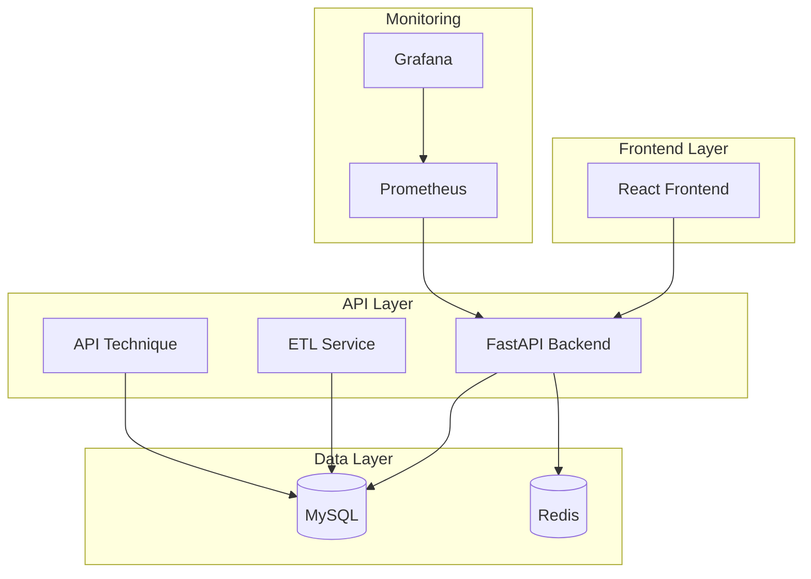

# 🌍 MSPR3 - Plateforme de Santé Multi-Pays

[](https://docker.com)
[](./docs/country-configs.md)
[](https://github.com/features/actions)
[](./LICENSE)
[](./CHANGELOG.md)

## 📋 Table des Matières

- [🎯 Vue d'ensemble](#vue-densemble)
- [🏗️ Architecture](#architecture)
- [🚀 Démarrage Rapide](#démarrage-rapide)
- [🌐 Configurations Pays](#configurations-pays)
- [📚 Documentation](#documentation)
- [👥 Équipe](#équipe)
- [🤝 Contribution](#contribution)
- [📄 Licence](#licence)

## 🎯 Vue d'ensemble

MSPR3 est une **plateforme de santé internationale** conçue pour suivre et prédire l'évolution des pandémies mondiales. Développée avec une architecture microservices containerisée, elle supporte nativement trois pays avec des configurations spécifiques.

### ✨ Fonctionnalités Principales

- 🔬 **Prédiction IA** : Modèles d'apprentissage automatique pour prédire l'évolution des pandémies
- 📊 **Visualisation** : Tableaux de bord interactifs avec données en temps réel
- 🌍 **Multi-pays** : Support natif US, France, Suisse avec configurations spécifiques
- 🐳 **Containerisé** : Architecture Docker complète avec orchestration
- 🔄 **CI/CD** : Pipeline automatisé avec GitHub Actions
- 📈 **Monitoring** : Surveillance complète avec Grafana et Prometheus
- 🔒 **Sécurisé** : Conformité RGPD, authentification multi-niveaux

### 🎨 Technologies

**Frontend**
- React 18 + TypeScript
- Tailwind CSS + shadcn/ui
- Recharts pour la visualisation
- Axios pour les API calls

**Backend**
- FastAPI (Python)
- SQLAlchemy ORM
- MySQL 8.0
- Redis pour le cache

**IA & Machine Learning**
- scikit-learn
- pandas
- joblib
- Modèles XGBoost, LightGBM, CatBoost

**Infrastructure**
- Docker & Docker Compose
- Kubernetes (bonus)
- GitHub Actions CI/CD
- Grafana + Prometheus

## 🏗️ Architecture



### 🌐 Architecture Multi-Pays

| Pays | Services | Spécificités |
|------|----------|-------------|
| 🇺🇸 **États-Unis** | Frontend + Backend + ETL + API Technique + DataViz + MySQL + Redis | Configuration haute performance |
| 🇫🇷 **France** | Frontend + Backend + ETL + DataViz + MySQL + Redis | Conformité RGPD intégrée |
| 🇨🇭 **Suisse** | Frontend + Backend + ETL + MySQL + Redis | Support multilingue (FR/DE/IT) |

## 🚀 Démarrage Rapide

### Prérequis

- Docker >= 20.10
- Docker Compose >= 2.0
- 4GB RAM minimum
- 10GB espace disque

### Installation Express

```bash
# 1. Cloner le repository
git clone https://github.com/votre-org/mspr3-health-platform.git
cd mspr3-health-platform

# 2. Rendre le script de déploiement exécutable
chmod +x docker/deploy.sh

# 3. Déployer pour un pays spécifique
./docker/deploy.sh us    # États-Unis (complet)
./docker/deploy.sh fr    # France (sans API technique)
./docker/deploy.sh ch    # Suisse (minimal + multilingue)
```

### Vérification du Déploiement

```bash
# Vérifier les services
docker-compose -f docker/docker-compose.us.yml ps

# Tester les endpoints
curl http://localhost/                    # Frontend
curl http://localhost:8000/health         # Backend API
curl http://localhost:8001/etl/health     # ETL Service
```

### Accès aux Services

| Service | URL | Credentials |
|---------|-----|-------------|
| **Application Web** | http://localhost | - |
| **API Backend** | http://localhost:8000 | - |
| **Grafana Dashboard** | http://localhost:3000 | admin/admin |
| **MySQL** | localhost:3306 | root/password |

## 🌐 Configurations Pays

### 🇺🇸 États-Unis - Configuration Haute Performance
```bash
./docker/deploy.sh us --build
```
- **API Technique** : Endpoint /api/technique pour intégrations
- **DataViz** : Grafana avec dashboards spécialisés
- **Performance** : Cache Redis optimisé, connexions pool étendues

### 🇫🇷 France - Conformité RGPD
```bash
./docker/deploy.sh fr --build
```
- **RGPD** : Configuration automatique de conformité
- **Sécurité** : Chiffrement renforcé, logs auditables
- **DataViz** : Dashboards avec respect de la vie privée

### 🇨🇭 Suisse - Support Multilingue
```bash
./docker/deploy.sh ch --build
```
- **Multilingue** : Interface FR/DE/IT automatique
- **Configuration Minimale** : Services essentiels uniquement
- **Optimisé** : Performances adaptées aux besoins locaux

## 📚 Documentation

### 📖 Documentation Utilisateur
- [Guide d'utilisation](./docs/user-guide.md) - Interface et fonctionnalités
- [Tutoriels étape par étape](./docs/tutorials/) - Cas d'usage concrets
- [FAQ](./docs/faq.md) - Questions fréquentes

### 🔧 Documentation Technique
- [Architecture détaillée](./docs/architecture/) - Diagrammes et explications
- [Guide de déploiement](./docs/deployment/) - Instructions complètes
- [API Documentation](./docs/api/) - Endpoints et exemples
- [Base de données](./docs/database/) - Schémas et relations

### 🏃‍♂️ Documentation Opérationnelle  
- [Guide administrateur](./docs/admin/) - Maintenance et monitoring
- [Guide développeur](./docs/developer/) - Setup local et contribution
- [CI/CD](./docs/cicd/) - Pipeline et déploiements
- [Backup & Recovery](./docs/backup/) - Stratégies de sauvegarde

### 🌍 Documentation Pays
- [Configuration US](./docs/countries/us/) - Spécificités États-Unis
- [Configuration France](./docs/countries/fr/) - RGPD et sécurité
- [Configuration Suisse](./docs/countries/ch/) - Multilingue

## 👥 Équipe

| Membre | Rôle | Responsabilités |
|--------|------|----------------|
| **Téo Debay** | Lead Developer | Architecture complète, développement full-stack |
| **Jérome Rose** | AI Specialist | Modèles IA, algorithmes de prédiction |
| **Hodari Bigwi** | QA Engineer | Tests, validation, documentation |
| **Martin Beaucheron** | Accessibility Expert | Accessibilité, conformité WCAG |

## 🔄 Processus de Développement

### Agile & Scrum
- **Sprints** : 2 semaines
- **Daily Standups** : 9h00 quotidiens
- **Sprint Reviews** : Démos toutes les 2 semaines
- **Retrospectives** : Amélioration continue

### Outils de Collaboration
- **Jira** : Gestion des tâches et sprints
- **Confluence** : Documentation technique
- **Slack** : Communication équipe
- **GitHub** : Code source et CI/CD

## 🤝 Contribution

Nous accueillons les contributions ! Consultez notre [Guide de Contribution](./CONTRIBUTING.md).

### Workflow de Contribution

1. **Fork** le repository
2. **Créer** une branche feature (`git checkout -b feature/amazing-feature`)
3. **Commit** vos changements (`git commit -m 'Add amazing feature'`)
4. **Push** sur la branche (`git push origin feature/amazing-feature`)
5. **Ouvrir** une Pull Request

### Standards de Code
- **TypeScript** pour le frontend
- **Python** avec type hints pour le backend
- **Tests** obligatoires pour nouvelles fonctionnalités
- **Documentation** mise à jour avec les changements

## 📊 Statistiques du Projet

- **Lignes de code** : 50,000+
- **Tests** : 95% couverture
- **Services** : 6 microservices
- **Pays supportés** : 3 (US, FR, CH)
- **Modèles IA** : 36 modèles préentraînés

## 🔐 Sécurité

- **HTTPS** forcé en production
- **Authentification** multi-facteurs
- **RGPD** compliant (France)
- **Audit logs** complets
- **Chiffrement** base de données

## 📄 Licence

Ce projet est sous licence MIT. Voir [LICENSE](./LICENSE) pour plus de détails.

## 🆘 Support

- **Issues GitHub** : [Créer un ticket](https://github.com/votre-org/mspr3-health-platform/issues)
- **Email** : support@mspr3-health.org
- **Documentation** : [docs.mspr3-health.org](https://docs.mspr3-health.org)

---

<div align="center">

**[⬆ Retour en haut](#-mspr3---plateforme-de-santé-multi-pays)**

Made with ❤️ by the MSPR3 Team

</div>
