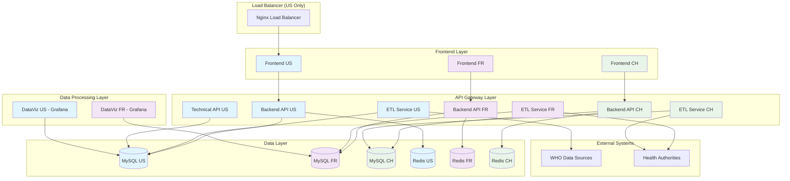
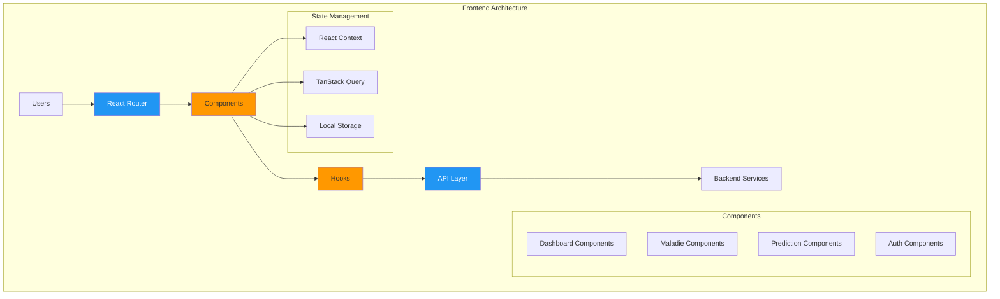
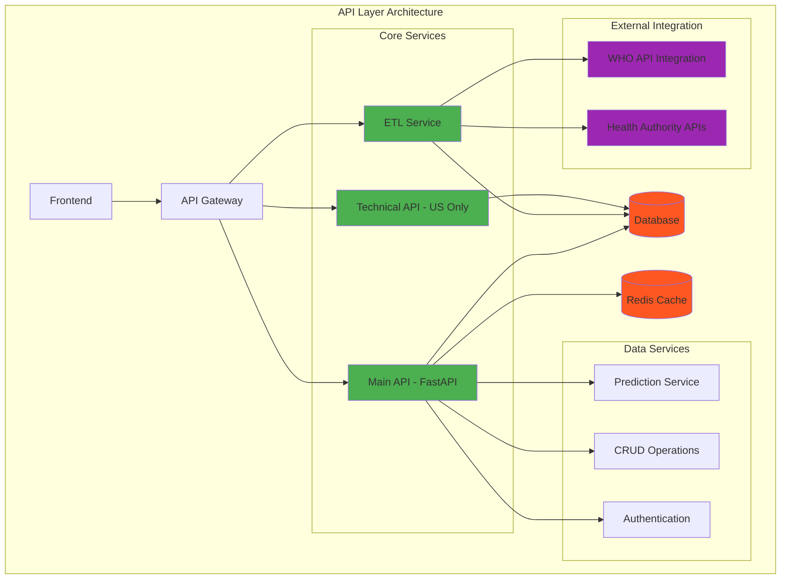
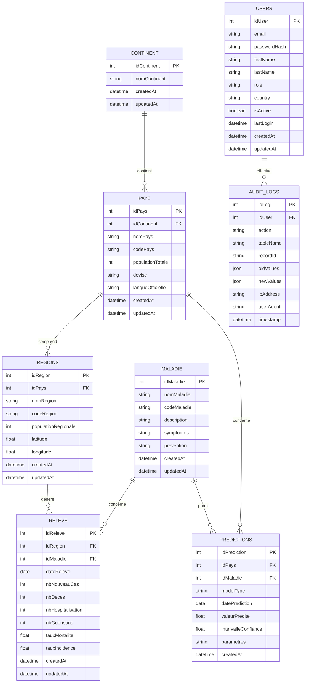
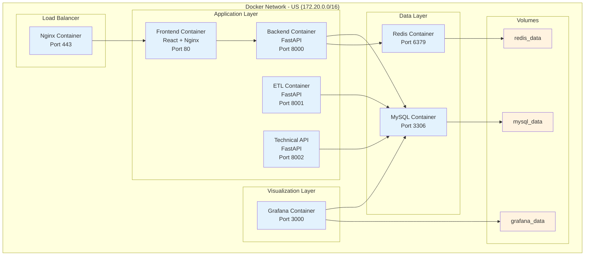
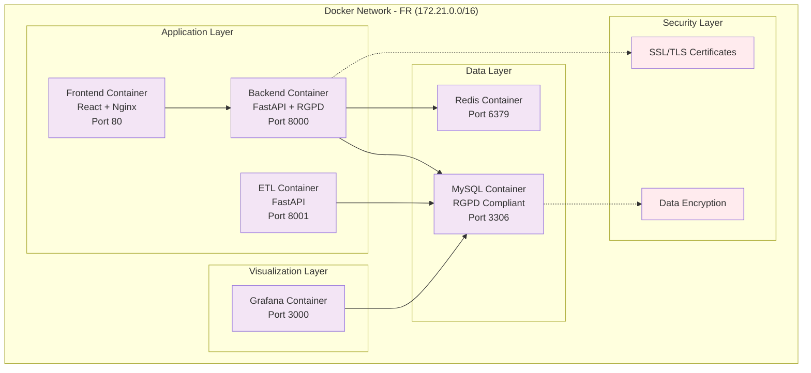
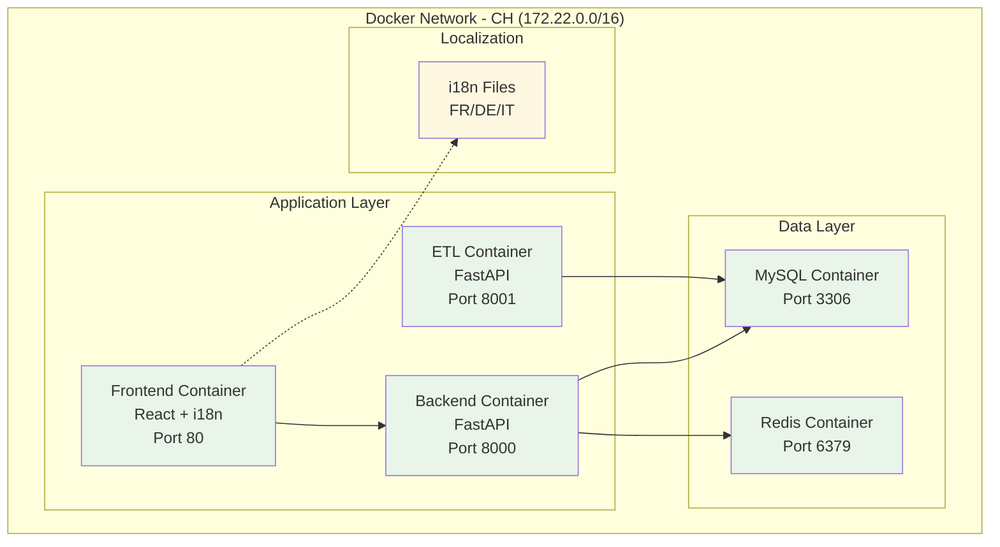
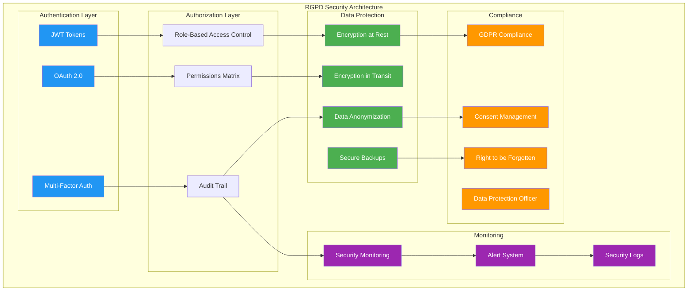
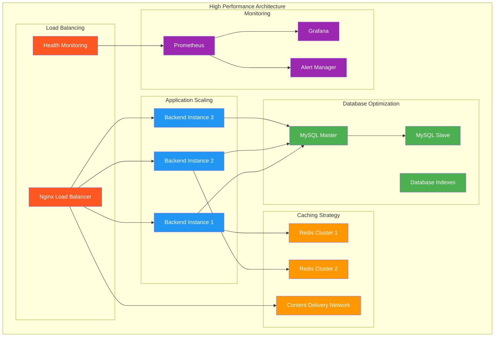

# Documentation UML - Architecture MSPR3 Multi-Country Platform

## Vue d'Ensemble de l'Architecture

### Diagramme d'Architecture Générale

## Diagrammes par Couche

### 1. Couche de Présentation

### 2. Couche API et Services

### 3. Couche de Données

## Diagrammes de Déploiement

### 1. Architecture Container - États-Unis (Configuration Complète)

### 2. Architecture Container - France (Sans Technical API)

### 3. Architecture Container - Suisse (Configuration Minimale)

## Diagrammes de Sécurité

### 1. Architecture de Sécurité - France (RGPD)

## Diagrammes de Performance

### 1. Architecture Haute Performance - États-Unis

## Conclusion

Cette documentation UML fournit une vue complète de l'architecture MSPR3 Multi-Country Platform, incluant :

- **Architecture générale** avec les différentes couches
- **Modèle de données** avec les relations entre entités
- **Architecture de déploiement** spécifique à chaque pays
- **Sécurité et conformité** notamment pour la France (RGPD)
- **Performance et scalabilité** pour les États-Unis

L'architecture est conçue pour être :
- **Scalable** : Peut gérer de grandes volumes de données
- **Sécurisée** : Conforme aux réglementations locales
- **Flexible** : Adaptable aux besoins spécifiques de chaque pays
- **Maintenant** : Architecture modulaire et bien documentée

---
*Documentation générée pour MSPR3 - Architecture Multi-Country Platform*
