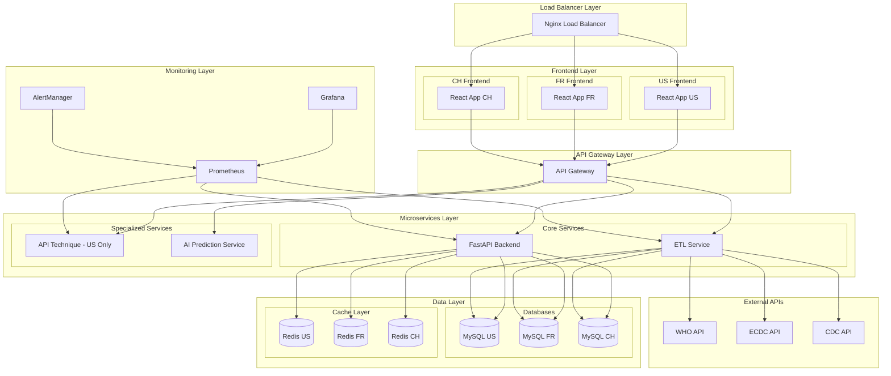
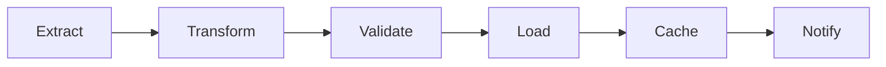
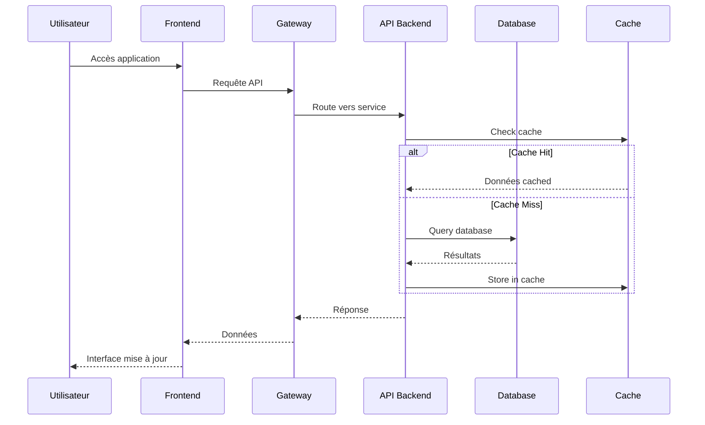
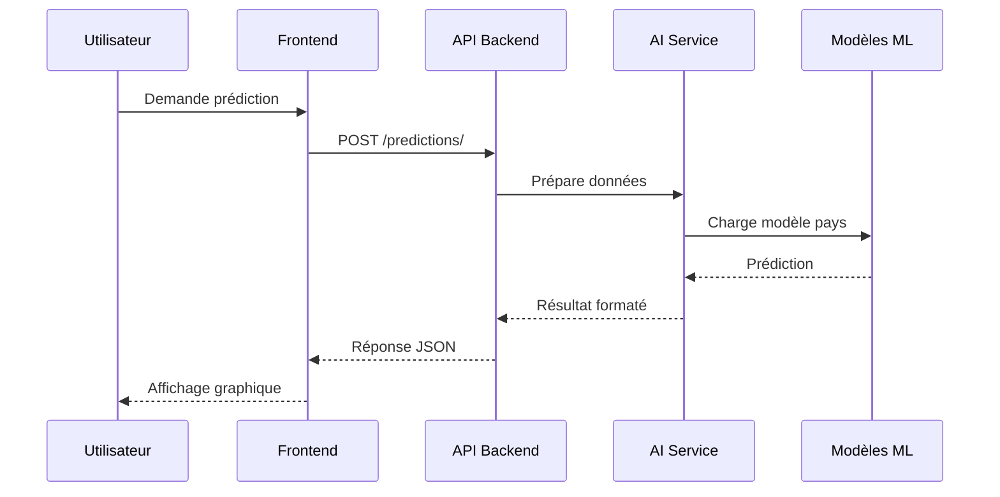
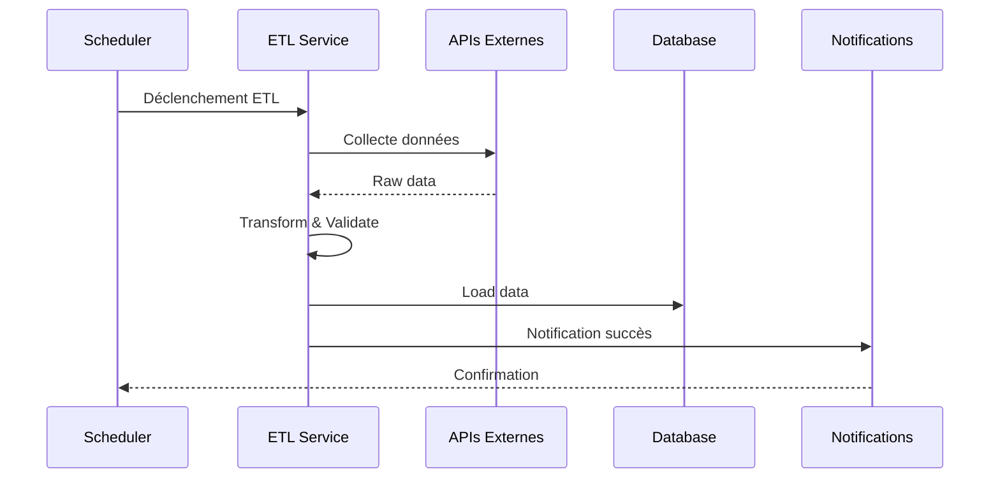
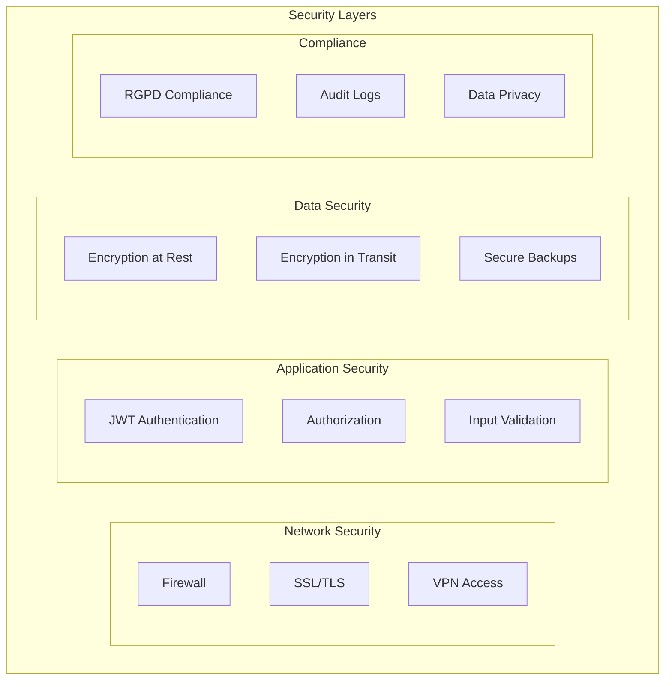

# 🏗️ Architecture MSPR3 - Vue d'ensemble Technique

## Table des Matières
- [Architecture Générale](#architecture-générale)
- [Microservices](#microservices)
- [Flux de Données](#flux-de-données)
- [Technologies](#technologies)
- [Sécurité](#sécurité)
- [Performance](#performance)

## Architecture Générale

MSPR3 suit une **architecture microservices containerisée** conçue pour la scalabilité internationale et la maintenance simplifiée.

### Diagramme d'Architecture Global



## Microservices

### 1. Frontend Service (React)
**Rôle** : Interface utilisateur responsive et accessible

**Technologies** :
- React 18 + TypeScript
- Tailwind CSS + shadcn/ui
- Recharts pour visualisation
- React Router pour navigation

**Spécificités par pays** :
- **US** : Thème haute performance, API technique intégrée
- **FR** : Interface RGPD-compliant, cookies management
- **CH** : Support multilingue (FR/DE/IT), adaptation culturelle

### 2. Backend API Service (FastAPI)
**Rôle** : API REST principale avec logique métier

**Endpoints principaux** :
```
/api/v1/
├── auth/           # Authentification
├── predictions/    # Prédictions IA
├── maladies/      # Catalogue des maladies
├── pays/          # Données géographiques
├── releves/       # Relevés épidémiologiques
└── health/        # Health checks
```

**Fonctionnalités** :
- Authentification JWT
- Validation Pydantic
- ORM SQLAlchemy
- Cache Redis intégré
- Rate limiting par pays

### 3. ETL Service (Extract, Transform, Load)
**Rôle** : Collecte et traitement des données externes

**Sources de données** :
- **WHO** : Données mondiales OMS
- **ECDC** : Centre européen de prévention
- **CDC** : Centers for Disease Control (US)
- **API nationales** : Sources locales par pays

**Pipeline ETL** :


### 4. API Technique Service (US uniquement)
**Rôle** : API spécialisée pour intégrations tierces

**Fonctionnalités** :
- Endpoints B2B
- Rate limiting élevé
- Documentation OpenAPI
- Monitoring avancé
- Support technique dédié

### 5. DataViz Service (US/FR uniquement)
**Rôle** : Visualisation avancée avec Grafana

**Dashboards** :
- **Executive Dashboard** : KPIs généraux
- **Operational Dashboard** : Monitoring temps réel
- **Prediction Dashboard** : Résultats IA
- **Country-specific** : Métriques par pays

### 6. AI Prediction Service
**Rôle** : Modèles d'intelligence artificielle

**Modèles disponibles** :
- **Hospitalisation** : Prédiction des admissions
- **Nouveaux cas** : Évolution épidémique
- **Taux mortalité** : Risk assessment
- **Temporels** : Prédictions LSTM

## Flux de Données

### 1. Flux Utilisateur Standard


### 2. Flux Prédiction IA


### 3. Flux ETL


## Technologies

### Stack Technique Détaillé

#### Frontend
```yaml
Base:
  - React: 18.3.1
  - TypeScript: 5.0+
  - Vite: 5.0+

UI/UX:
  - Tailwind CSS: 3.4+
  - shadcn/ui: Latest
  - Lucide Icons: 0.400+
  - Recharts: 2.12+

State Management:
  - React Query: 5.0+
  - Context API: Built-in
  - Local Storage: Web API

Routing:
  - React Router: 6.26+
  - Protected Routes: Custom
  - Lazy Loading: React.lazy
```

#### Backend
```yaml
Core:
  - Python: 3.11+
  - FastAPI: 0.100+
  - Uvicorn: 0.23+

Database:
  - MySQL: 8.0+
  - SQLAlchemy: 2.0+
  - Alembic: 1.12+

Cache:
  - Redis: 7.0+
  - Redis-py: 5.0+

AI/ML:
  - scikit-learn: 1.3+
  - pandas: 2.0+
  - numpy: 1.24+
  - joblib: 1.3+
```

#### Infrastructure
```yaml
Containerization:
  - Docker: 20.10+
  - Docker Compose: 2.0+
  - Multi-stage builds: Yes

Orchestration:
  - Kubernetes: 1.28+ (bonus)
  - Helm: 3.12+ (bonus)

CI/CD:
  - GitHub Actions: Latest
  - Docker Registry: Docker Hub
  - Automated testing: pytest

Monitoring:
  - Grafana: 10.0+
  - Prometheus: 2.40+
  - AlertManager: 0.25+
```

## Sécurité

### Architecture de Sécurité



### Mesures Implémentées

#### 1. Authentification & Autorisation
- **JWT Tokens** : Expiration 24h, refresh tokens
- **Multi-factor Authentication** : TOTP support
- **Role-based Access Control** : Admin, User, Read-only
- **Session Management** : Secure cookies, CSRF protection

#### 2. Chiffrement
- **HTTPS obligatoire** : TLS 1.3 minimum
- **Base de données** : Encryption at rest (MySQL 8.0)
- **Communications** : TLS inter-services
- **Secrets** : HashiCorp Vault ou Docker Secrets

#### 3. Conformité RGPD (France)
- **Consentement** : Gestion explicite des cookies
- **Droit à l'oubli** : API de suppression
- **Portabilité** : Export données utilisateur
- **Audit trails** : Logs conformes CNIL

#### 4. Monitoring Sécurité
- **Intrusion Detection** : Fail2ban
- **Vulnerability Scanning** : Trivy dans CI/CD
- **Log Analysis** : ELK Stack (bonus)
- **Incident Response** : Procédures documentées

## Performance

### Optimisations par Couche

#### 1. Frontend
- **Code splitting** : Routes et composants lazy
- **Tree shaking** : Bundle optimization Vite
- **Caching** : Service Worker, API cache
- **CDN** : Assets statiques
- **Image optimization** : WebP, lazy loading

#### 2. Backend
- **Connection pooling** : SQLAlchemy optimisé
- **Query optimization** : Index database, N+1 prevention
- **Caching strategy** : Redis multi-layer
- **Async processing** : FastAPI async/await
- **Rate limiting** : Protection DDoS

#### 3. Base de Données
- **Indexing strategy** : Colonnes frequently queried
- **Partitioning** : Tables par pays/date
- **Read replicas** : Load balancing lectures
- **Query optimization** : EXPLAIN plans
- **Connection management** : Pool size adaptatif

#### 4. Infrastructure
- **Load balancing** : Nginx upstream
- **Auto-scaling** : Kubernetes HPA (bonus)
- **Resource limits** : CPU/Memory constraints
- **Health checks** : Liveness/Readiness probes
- **Metrics collection** : Prometheus exporters

### Benchmarks de Performance

| Métrique | US (Haute Perf) | FR (Standard) | CH (Optimisé) |
|----------|-----------------|---------------|---------------|
| **Response Time** | < 100ms | < 200ms | < 150ms |
| **Throughput** | 1000 req/s | 500 req/s | 300 req/s |
| **Availability** | 99.9% | 99.5% | 99.7% |
| **Concurrent Users** | 10,000 | 5,000 | 2,000 |

---

Cette architecture garantit une **scalabilité internationale**, une **sécurité renforcée** et des **performances optimales** pour chaque contexte pays.
