# 🌐 Suisse - Configuration Multilingue Complète

## Table des Matières
- [Vue d'ensemble Multilingue](#vue-densemble-multilingue)
- [Configuration Technique](#configuration-technique)
- [Gestion des Traductions](#gestion-des-traductions)
- [Interface Utilisateur](#interface-utilisateur)
- [API Multilingue](#api-multilingue)
- [Optimisations Culturelles](#optimisations-culturelles)

## Vue d'ensemble Multilingue

La configuration Suisse de MSPR3 supporte nativement les **4 langues officielles suisses** avec adaptation culturelle et juridique spécifique.

### Langues Supportées

```mermaid
graph TB
    subgraph "Langues Officielles Suisse"
        FR[Français - 22.5%]
        DE[Allemand - 62.3%]
        IT[Italien - 8.1%]
        RM[Romanche - 0.5%]
    end
    
    subgraph "Configuration MSPR3-CH"
        I18N[Système i18n]
        AUTO[Détection Auto]
        FALLBACK[Fallback FR]
        REGIONAL[Adaptations Régionales]
    end
    
    FR --> I18N
    DE --> I18N
    IT --> I18N
    RM --> FALLBACK
    
    I18N --> AUTO
    I18N --> REGIONAL
```



### Distribution Linguistique par Canton

| Canton | Langue Principale | Langues Secondaires | Configuration |
|--------|------------------|-------------------|----------------|
| **Zurich** | Allemand (87%) | Français, Italien | DE primary, FR/IT secondary |
| **Genève** | Français (75%) | Allemand, Italien | FR primary, DE/IT secondary |
| **Ticino** | Italien (83%) | Français, Allemand | IT primary, FR/DE secondary |
| **Grisons** | Allemand (76%) | Romanche (14%), Italien (10%) | DE primary, RM/IT secondary |

## Configuration Technique

### Variables d'Environnement Multilingues

```bash
# docker/.env.ch - Configuration multilingue
COUNTRY=ch
ENVIRONMENT=production

# Multilingual Configuration
DEFAULT_LANGUAGE=fr
SUPPORTED_LANGUAGES=fr,de,it,rm
FALLBACK_LANGUAGE=fr
RTL_LANGUAGES=          # Aucune pour la Suisse
REGIONAL_DETECTION=true

# Translation Services
TRANSLATION_PROVIDER=local    # local, deepl, google
DEEPL_API_KEY=your_deepl_key  # Optionnel pour traduction auto
AUTO_TRANSLATE=false          # Traduction automatique désactivée par défaut

# Cultural Adaptation
DATE_FORMAT_FR=DD.MM.YYYY
DATE_FORMAT_DE=DD.MM.YYYY    # Format suisse-allemand
DATE_FORMAT_IT=DD.MM.YYYY
CURRENCY=CHF
TIMEZONE=Europe/Zurich

# Legal Compliance
SWISS_DATA_PROTECTION=true
FEDERAL_HEALTH_COMPLIANCE=true
CANTONAL_REGULATIONS=true

# Performance
I18N_CACHE_TTL=3600          # Cache traductions 1h
LANGUAGE_BUNDLE_SIZE=50KB    # Taille max par bundle
LAZY_LOAD_TRANSLATIONS=true  # Chargement à la demande
```

### Docker Compose Multilingue

```yaml
# docker/docker-compose.ch.yml - Services multilingues
version: '3.8'

services:
  frontend:
    image: mspr3-frontend:ch-multilingual
    environment:
      - REACT_APP_DEFAULT_LANG=fr
      - REACT_APP_SUPPORTED_LANGS=fr,de,it,rm
      - REACT_APP_I18N_DEBUG=false
    volumes:
      - ./i18n/switzerland-multilingual.yml:/app/public/locales/config.yml
      - i18n_cache:/app/cache/i18n

  backend:
    image: mspr3-backend:ch-multilingual
    environment:
      - I18N_ENABLED=true
      - SUPPORTED_LANGUAGES=fr,de,it,rm
      - TRANSLATION_FALLBACK=fr
    volumes:
      - ./i18n/api-translations:/app/translations
      - i18n_backend_cache:/app/cache/translations

  # Service de traduction (optionnel)
  translation-service:
    image: mspr3-translation-service:latest
    ports:
      - "8004:8004"
    environment:
      - DEEPL_API_KEY=${DEEPL_API_KEY}
      - TRANSLATION_CACHE_SIZE=1000
      - FALLBACK_LANGUAGE=fr
    volumes:
      - translation_cache:/cache

volumes:
  i18n_cache:
  i18n_backend_cache:
  translation_cache:
```

### Configuration i18n Détaillée

```yaml
# i18n/switzerland-multilingual.yml
switzerland_i18n:
  metadata:
    version: "1.0.0"
    last_updated: "2024-01-15"
    maintainer: "MSPR3 Swiss Team"
  
  languages:
    fr:
      name: "Français"
      native_name: "Français"
      code: "fr-CH"
      locale: "fr_CH"
      direction: "ltr"
      percentage: 22.5
      regions: ["GE", "VD", "NE", "JU", "FR", "VS"]
      fallback: null
      
    de:
      name: "Deutsch"
      native_name: "Deutsch"
      code: "de-CH"
      locale: "de_CH"
      direction: "ltr"
      percentage: 62.3
      regions: ["ZH", "BE", "LU", "SG", "AG", "TG"]
      fallback: "fr"
      
    it:
      name: "Italiano"
      native_name: "Italiano"
      code: "it-CH"
      locale: "it_CH"
      direction: "ltr"
      percentage: 8.1
      regions: ["TI", "GR"]
      fallback: "fr"
      
    rm:
      name: "Rumantsch"
      native_name: "Rumantsch"
      code: "rm-CH"
      locale: "rm_CH"
      direction: "ltr"
      percentage: 0.5
      regions: ["GR"]
      fallback: "de"  # Fallback vers allemand puis français
  
  regional_settings:
    date_formats:
      fr: "DD.MM.YYYY"
      de: "DD.MM.YYYY"
      it: "DD.MM.YYYY"
      rm: "DD.MM.YYYY"
    
    time_formats:
      fr: "HH:mm"
      de: "HH:mm"
      it: "HH:mm"
      rm: "HH:mm"
    
    number_formats:
      fr: "1'234.56"    # Apostrophe suisse
      de: "1'234.56"
      it: "1'234,56"
      rm: "1'234.56"
    
    currency:
      symbol: "CHF"
      position: "after"  # 12.50 CHF
      decimal_separator: "."
      thousand_separator: "'"
  
  cultural_adaptations:
    healthcare_terms:
      fr:
        hospital: "hôpital"
        doctor: "médecin"
        insurance: "assurance maladie"
      de:
        hospital: "Spital"      # Spital vs Krankenhaus
        doctor: "Arzt"
        insurance: "Krankenversicherung"
      it:
        hospital: "ospedale"
        doctor: "medico"
        insurance: "assicurazione malattia"
    
    legal_terms:
      data_protection:
        fr: "Protection des données (LPD)"
        de: "Datenschutz (DSG)"
        it: "Protezione dei dati (LPD)"
      
      federal_law:
        fr: "Droit fédéral suisse"
        de: "Schweizerisches Bundesrecht"
        it: "Diritto federale svizzero"
```

## Gestion des Traductions

### Structure des Fichiers de Traduction

```
src/locales/
├── fr/
│   ├── common.json          # Termes communs
│   ├── navigation.json      # Navigation
│   ├── forms.json          # Formulaires
│   ├── health.json         # Terminologie médicale
│   ├── predictions.json    # Interface prédictions
│   ├── legal.json          # Mentions légales
│   └── errors.json         # Messages d'erreur
├── de/
│   ├── common.json
│   ├── navigation.json
│   ├── forms.json
│   ├── health.json
│   ├── predictions.json
│   ├── legal.json
│   └── errors.json
├── it/
│   └── ... (même structure)
└── rm/
    └── ... (structure réduite avec fallbacks)
```

### Exemple de Traductions Spécialisées

```json
// src/locales/fr/health.json
{
  "health_terminology": {
    "pandemic": "pandémie",
    "epidemic": "épidémie",
    "hospitalization": "hospitalisation",
    "icu": "soins intensifs",
    "mortality_rate": "taux de mortalité",
    "vaccination": "vaccination",
    "symptoms": "symptômes",
    "incubation_period": "période d'incubation",
    "transmission": "transmission",
    "prevention": "prévention"
  },
  "swiss_health_system": {
    "federal_office": "Office fédéral de la santé publique (OFSP)",
    "cantonal_authority": "Autorité cantonale de santé",
    "health_insurance": "Assurance maladie obligatoire (LAMal)",
    "hospital_network": "Réseau hospitalier suisse",
    "emergency_number": "Numéro d'urgence: 144"
  },
  "predictions": {
    "title": "Prédictions Épidémiologiques",
    "subtitle": "Modèles d'IA pour la Suisse",
    "input_data": "Données d'entrée",
    "results": "Résultats de prédiction",
    "confidence": "Niveau de confiance",
    "methodology": "Méthodologie utilisée",
    "disclaimer": "Ces prédictions sont indicatives et ne remplacent pas l'avis médical professionnel."
  }
}
```

```json
// src/locales/de/health.json
{
  "health_terminology": {
    "pandemic": "Pandemie",
    "epidemic": "Epidemie", 
    "hospitalization": "Hospitalisierung",
    "icu": "Intensivpflege",
    "mortality_rate": "Sterblichkeitsrate",
    "vaccination": "Impfung",
    "symptoms": "Symptome",
    "incubation_period": "Inkubationszeit",
    "transmission": "Übertragung",
    "prevention": "Prävention"
  },
  "swiss_health_system": {
    "federal_office": "Bundesamt für Gesundheit (BAG)",
    "cantonal_authority": "Kantonsärztliche Behörde",
    "health_insurance": "Obligatorische Krankenpflegeversicherung (KVG)",
    "hospital_network": "Schweizer Spitalnetzwerk",
    "emergency_number": "Notrufnummer: 144"
  },
  "predictions": {
    "title": "Epidemiologische Vorhersagen",
    "subtitle": "KI-Modelle für die Schweiz",
    "input_data": "Eingabedaten",
    "results": "Vorhersageergebnisse",
    "confidence": "Vertrauensniveau", 
    "methodology": "Verwendete Methodik",
    "disclaimer": "Diese Vorhersagen sind indikativ und ersetzen keine professionelle medizinische Beratung."
  }
}
```

### Système de Traduction Automatique

```typescript
// src/services/translation.service.ts
interface TranslationConfig {
  provider: 'local' | 'deepl' | 'google';
  fallbackLanguage: string;
  cacheEnabled: boolean;
  autoDetectLanguage: boolean;
}

interface RegionalContext {
  canton?: string;
  region?: string;
  culturalPreferences?: Record<string, any>;
}

class SwissTranslationService {
  private config: TranslationConfig;
  private translations: Map<string, Record<string, string>> = new Map();
  private cache: Map<string, string> = new Map();

  constructor(config: TranslationConfig) {
    this.config = config;
    this.loadTranslations();
  }

  async translate(
    key: string, 
    targetLang: string, 
    context?: RegionalContext,
    variables?: Record<string, any>
  ): Promise<string> {
    // 1. Vérifier cache local
    const cacheKey = `${key}_${targetLang}_${JSON.stringify(context)}`;
    if (this.cache.has(cacheKey)) {
      return this.interpolateVariables(this.cache.get(cacheKey)!, variables);
    }

    // 2. Chercher traduction locale
    const localTranslation = this.getLocalTranslation(key, targetLang);
    if (localTranslation) {
      this.cache.set(cacheKey, localTranslation);
      return this.interpolateVariables(localTranslation, variables);
    }

    // 3. Fallback vers langue par défaut
    const fallbackTranslation = this.getLocalTranslation(key, this.config.fallbackLanguage);
    if (fallbackTranslation) {
      this.cache.set(cacheKey, fallbackTranslation);
      return this.interpolateVariables(fallbackTranslation, variables);
    }

    // 4. Traduction automatique si configurée
    if (this.config.provider !== 'local') {
      try {
        const autoTranslation = await this.getAutoTranslation(key, targetLang, context);
        if (autoTranslation) {
          this.cache.set(cacheKey, autoTranslation);
          return this.interpolateVariables(autoTranslation, variables);
        }
      } catch (error) {
        console.warn('Auto-translation failed:', error);
      }
    }

    // 5. Retourner la clé si aucune traduction trouvée
    return key;
  }

  private getLocalTranslation(key: string, language: string): string | null {
    const langTranslations = this.translations.get(language);
    if (!langTranslations) return null;

    // Support des clés imbriquées (ex: "health.predictions.title")
    const keys = key.split('.');
    let current: any = langTranslations;
    
    for (const k of keys) {
      if (current && typeof current === 'object' && k in current) {
        current = current[k];
      } else {
        return null;
      }
    }

    return typeof current === 'string' ? current : null;
  }

  private async getAutoTranslation(
    key: string, 
    targetLang: string, 
    context?: RegionalContext
  ): Promise<string | null> {
    // Obtenir le texte source depuis la langue fallback
    const sourceText = this.getLocalTranslation(key, this.config.fallbackLanguage);
    if (!sourceText) return null;

    // Adapter selon le contexte régional
    const adaptedSource = this.adaptToRegionalContext(sourceText, context);

    switch (this.config.provider) {
      case 'deepl':
        return this.translateWithDeepL(adaptedSource, targetLang);
      case 'google':
        return this.translateWithGoogle(adaptedSource, targetLang);
      default:
        return null;
    }
  }

  private adaptToRegionalContext(text: string, context?: RegionalContext): string {
    if (!context) return text;

    // Adaptations spécifiques par canton
    if (context.canton) {
      const adaptations = CANTONAL_ADAPTATIONS[context.canton];
      if (adaptations) {
        for (const [pattern, replacement] of Object.entries(adaptations)) {
          text = text.replace(new RegExp(pattern, 'gi'), replacement);
        }
      }
    }

    return text;
  }

  private interpolateVariables(text: string, variables?: Record<string, any>): string {
    if (!variables) return text;

    return text.replace(/\{\{(\w+)\}\}/g, (match, key) => {
      return variables[key]?.toString() || match;
    });
  }

  // Détection automatique de langue basée sur géolocalisation/IP
  async detectUserLanguage(userLocation?: { lat: number; lng: number }): Promise<string> {
    if (userLocation) {
      const region = await this.getSwissRegionFromCoordinates(userLocation);
      return this.getRegionalLanguage(region);
    }

    // Fallback browser language
    const browserLang = navigator.language.split('-')[0];
    const supportedLangs = ['fr', 'de', 'it', 'rm'];
    
    return supportedLangs.includes(browserLang) ? browserLang : 'fr';
  }

  private async getSwissRegionFromCoordinates(location: { lat: number; lng: number }): Promise<string> {
    // API de géolocalisation suisse (exemple avec swisstopo)
    try {
      const response = await fetch(
        `https://api3.geo.admin.ch/rest/services/api/MapServer/identify?geometry=${location.lng},${location.lat}&layers=all`
      );
      const data = await response.json();
      
      // Extraire le canton depuis la réponse
      const canton = data.results?.find((r: any) => r.layerName === 'canton')?.attributes?.name;
      return canton || 'unknown';
    } catch (error) {
      console.warn('Geolocation failed:', error);
      return 'unknown';
    }
  }

  private getRegionalLanguage(region: string): string {
    const REGIONAL_LANGUAGES: Record<string, string> = {
      'Genève': 'fr', 'Vaud': 'fr', 'Neuchâtel': 'fr', 'Jura': 'fr', 'Fribourg': 'fr', 'Valais': 'fr',
      'Zürich': 'de', 'Bern': 'de', 'Luzern': 'de', 'St. Gallen': 'de', 'Aargau': 'de', 'Thurgau': 'de',
      'Ticino': 'it',
      'Graubünden': 'de'  // Majoritairement allemand, mais supporte rm
    };

    return REGIONAL_LANGUAGES[region] || 'fr';
  }
}

// Adaptations cantonales spécifiques
const CANTONAL_ADAPTATIONS: Record<string, Record<string, string>> = {
  'Genève': {
    'hôpital': 'Hôpitaux Universitaires de Genève (HUG)',
    'urgences': 'Service d\'urgence - 144'
  },
  'Zürich': {
    'Spital': 'Universitätsspital Zürich',
    'Notfall': 'Notruf - 144'
  },
  'Ticino': {
    'ospedale': 'Ospedale Regionale di Lugano',
    'emergenza': 'Emergenza - 144'
  }
};

export default SwissTranslationService;
```

## Interface Utilisateur

### Sélecteur de Langue

```tsx
// src/components/LanguageSelector.tsx
import React, { useState, useEffect } from 'react';
import { Button } from '@/components/ui/button';
import { DropdownMenu, DropdownMenuContent, DropdownMenuItem, DropdownMenuTrigger } from '@/components/ui/dropdown-menu';
import { Globe, ChevronDown } from 'lucide-react';
import { useTranslation } from './i18n/TranslationContext';

interface Language {
  code: string;
  name: string;
  nativeName: string;
  flag: string;
  regions: string[];
}

const SWISS_LANGUAGES: Language[] = [
  {
    code: 'fr',
    name: 'Français',
    nativeName: 'Français',
    flag: '🇫🇷',
    regions: ['GE', 'VD', 'NE', 'JU', 'FR', 'VS']
  },
  {
    code: 'de', 
    name: 'Deutsch',
    nativeName: 'Deutsch',
    flag: '🇩🇪',
    regions: ['ZH', 'BE', 'LU', 'SG', 'AG', 'TG']
  },
  {
    code: 'it',
    name: 'Italiano', 
    nativeName: 'Italiano',
    flag: '🇮🇹',
    regions: ['TI', 'GR']
  },
  {
    code: 'rm',
    name: 'Rumantsch',
    nativeName: 'Rumantsch',
    flag: '🏔️',
    regions: ['GR']
  }
];

export const LanguageSelector: React.FC = () => {
  const { currentLanguage, changeLanguage, t } = useTranslation();
  const [detectedRegion, setDetectedRegion] = useState<string | null>(null);

  useEffect(() => {
    // Détection automatique de la région/canton
    detectUserRegion().then(setDetectedRegion);
  }, []);

  const getCurrentLanguage = () => {
    return SWISS_LANGUAGES.find(lang => lang.code === currentLanguage) || SWISS_LANGUAGES[0];
  };

  const handleLanguageChange = async (languageCode: string) => {
    await changeLanguage(languageCode);
    
    // Sauvegarder préférence utilisateur
    localStorage.setItem('mspr3-ch-language', languageCode);
    
    // Analytics pour optimiser traductions
    trackLanguageUsage(languageCode, detectedRegion);
  };

  const getRegionalSuggestion = () => {
    if (!detectedRegion) return null;
    
    const suggestedLang = SWISS_LANGUAGES.find(lang => 
      lang.regions.includes(detectedRegion)
    );
    
    return suggestedLang && suggestedLang.code !== currentLanguage ? suggestedLang : null;
  };

  const regionalSuggestion = getRegionalSuggestion();

  return (
    <div className="relative">
      {/* Suggestion régionale */}
      {regionalSuggestion && (
        <div className="mb-2 p-2 bg-blue-50 border border-blue-200 rounded-md text-sm">
          <p className="text-blue-800">
            {t('language.regional_suggestion', {
              region: detectedRegion,
              language: regionalSuggestion.nativeName
            })}
          </p>
          <Button
            size="sm"
            variant="outline"
            onClick={() => handleLanguageChange(regionalSuggestion.code)}
            className="mt-1"
          >
            {t('language.switch_to')} {regionalSuggestion.nativeName}
          </Button>
        </div>
      )}

      <DropdownMenu>
        <DropdownMenuTrigger asChild>
          <Button variant="outline" size="sm" className="min-w-[120px]">
            <Globe className="w-4 h-4 mr-2" />
            <span className="mr-1">{getCurrentLanguage().flag}</span>
            <span className="font-medium">{getCurrentLanguage().nativeName}</span>
            <ChevronDown className="w-4 h-4 ml-2" />
          </Button>
        </DropdownMenuTrigger>
        
        <DropdownMenuContent align="end" className="w-56">
          <div className="px-2 py-1.5 text-sm font-medium text-gray-700 border-b">
            {t('language.select_language')}
          </div>
          
          {SWISS_LANGUAGES.map((language) => (
            <DropdownMenuItem
              key={language.code}
              onClick={() => handleLanguageChange(language.code)}
              className={`flex items-center space-x-3 ${
                language.code === currentLanguage ? 'bg-blue-50 text-blue-700' : ''
              }`}
            >
              <span className="text-lg">{language.flag}</span>
              <div className="flex-1">
                <div className="font-medium">{language.nativeName}</div>
                <div className="text-xs text-gray-500">
                  {t('language.regions')}: {language.regions.join(', ')}
                </div>
              </div>
              {language.code === currentLanguage && (
                <div className="w-2 h-2 bg-blue-600 rounded-full"></div>
              )}
            </DropdownMenuItem>
          ))}
          
          <div className="border-t pt-2 mt-2">
            <div className="px-2 py-1 text-xs text-gray-500">
              {t('language.auto_detection')}: {detectedRegion || t('language.detecting')}
            </div>
          </div>
        </DropdownMenuContent>
      </DropdownMenu>
    </div>
  );
};

async function detectUserRegion(): Promise<string | null> {
  try {
    // Utiliser API de géolocalisation ou IP pour déterminer canton
    if ('geolocation' in navigator) {
      return new Promise((resolve) => {
        navigator.geolocation.getCurrentPosition(
          async (position) => {
            const { latitude, longitude } = position.coords;
            const region = await getCantonFromCoordinates(latitude, longitude);
            resolve(region);
          },
          () => resolve(null),
          { timeout: 5000 }
        );
      });
    }
  } catch (error) {
    console.warn('Region detection failed:', error);
  }
  
  return null;
}

async function getCantonFromCoordinates(lat: number, lng: number): Promise<string | null> {
  try {
    // API swisstopo pour déterminer le canton
    const response = await fetch(
      `https://api3.geo.admin.ch/rest/services/api/MapServer/identify?geometry=${lng},${lat}&layers=all&geometryType=esriGeometryPoint&returnGeometry=false`
    );
    
    const data = await response.json();
    const cantonInfo = data.results?.find((r: any) => r.layerName === 'canton');
    
    return cantonInfo?.attributes?.abbr || null;
  } catch (error) {
    console.warn('Canton detection failed:', error);
    return null;
  }
}

function trackLanguageUsage(language: string, region: string | null) {
  // Analytics pour améliorer l'expérience multilingue
  if (typeof gtag !== 'undefined') {
    gtag('event', 'language_change', {
      language: language,
      region: region,
      country: 'CH'
    });
  }
}
```

## API Multilingue

### Endpoints Spécialisés Suisse

```python
# api/ch_multilingual.py
from fastapi import APIRouter, Depends, Header, Query
from typing import Optional, Dict, List
from sqlalchemy.orm import Session

router = APIRouter(prefix="/api/v1/ch", tags=["Switzerland-Multilingual"])

@router.get("/langues-supportees")
async def get_supported_languages():
    """Retourne les langues supportées avec métadonnées"""
    return {
        "langues": [
            {
                "code": "fr",
                "nom": "Français",
                "nom_natif": "Français", 
                "pourcentage_population": 22.5,
                "cantons_principaux": ["GE", "VD", "NE", "JU", "FR", "VS"],
                "fallback": None
            },
            {
                "code": "de",
                "nom": "Allemand",
                "nom_natif": "Deutsch",
                "pourcentage_population": 62.3,
                "cantons_principaux": ["ZH", "BE", "LU", "SG", "AG", "TG"],
                "fallback": "fr"
            },
            {
                "code": "it", 
                "nom": "Italien",
                "nom_natif": "Italiano",
                "pourcentage_population": 8.1,
                "cantons_principaux": ["TI", "GR"],
                "fallback": "fr"
            },
            {
                "code": "rm",
                "nom": "Romanche", 
                "nom_natif": "Rumantsch",
                "pourcentage_population": 0.5,
                "cantons_principaux": ["GR"],
                "fallback": "de"
            }
        ],
        "langue_defaut": "fr",
        "detection_regionale": True
    }

@router.get("/traductions/{cle}")
async def get_translation(
    cle: str,
    langue: str = Query("fr", description="Code langue (fr, de, it, rm)"),
    canton: Optional[str] = Query(None, description="Code canton pour adaptation régionale"),
    variables: Optional[Dict] = Query({}, description="Variables pour interpolation")
):
    """Obtient une traduction avec adaptation régionale"""
    
    # Charger traductions selon la langue
    translations = await load_translations(langue)
    
    # Récupérer traduction de base
    translation = get_nested_translation(translations, cle)
    
    if not translation:
        # Fallback vers français si pas trouvé
        if langue != "fr":
            fr_translations = await load_translations("fr")
            translation = get_nested_translation(fr_translations, cle)
        
        if not translation:
            return {"traduction": cle, "langue": langue, "trouve": False}
    
    # Adaptation régionale si canton spécifié
    if canton:
        translation = adapt_translation_for_canton(translation, canton, langue)
    
    # Interpolation des variables
    if variables:
        translation = interpolate_variables(translation, variables)
    
    return {
        "traduction": translation,
        "langue": langue,
        "canton": canton,
        "trouve": True,
        "source": "local" if translation else "fallback"
    }

@router.post("/traductions/batch")
async def get_batch_translations(
    cles: List[str],
    langue: str = "fr",
    canton: Optional[str] = None,
    accept_language: Optional[str] = Header(None)
):
    """Récupère plusieurs traductions en une fois"""
    
    # Détecter langue depuis header si pas spécifiée
    if accept_language and langue == "fr":
        detected_lang = parse_accept_language_header(accept_language)
        if detected_lang in ["fr", "de", "it", "rm"]:
            langue = detected_lang
    
    translations = {}
    
    for cle in cles:
        translation = await get_single_translation(cle, langue, canton)
        translations[cle] = translation
    
    return {
        "traductions": translations,
        "langue": langue,
        "canton": canton,
        "cache_ttl": 3600
    }

@router.get("/detection-region")
async def detect_user_region(
    lat: Optional[float] = Query(None),
    lng: Optional[float] = Query(None),
    ip: Optional[str] = Header(None, alias="X-Real-IP")
):
    """Détecte la région/canton de l'utilisateur"""
    
    region_info = {
        "canton": None,
        "langue_suggeree": "fr",
        "methode_detection": None
    }
    
    # Tentative par coordonnées GPS
    if lat is not None and lng is not None:
        canton = await get_canton_from_coordinates(lat, lng)
        if canton:
            region_info.update({
                "canton": canton,
                "langue_suggeree": get_canton_primary_language(canton),
                "methode_detection": "gps"
            })
            return region_info
    
    # Tentative par géolocalisation IP
    if ip:
        region = await get_region_from_ip(ip)
        if region:
            region_info.update({
                "canton": region.get("canton"),
                "langue_suggeree": region.get("langue", "fr"),
                "methode_detection": "ip"
            })
            return region_info
    
    # Aucune détection possible
    region_info["methode_detection"] = "default"
    return region_info

# Fonctions utilitaires pour traductions
async def load_translations(language: str) -> Dict:
    """Charge les traductions depuis le cache ou fichiers"""
    cache_key = f"translations_{language}"
    
    # Vérifier cache Redis
    cached = await redis_client.get(cache_key)
    if cached:
        return json.loads(cached)
    
    # Charger depuis fichiers
    translations = {}
    translation_files = [
        "common", "navigation", "forms", "health", 
        "predictions", "legal", "errors"
    ]
    
    for file_name in translation_files:
        file_path = f"/app/translations/{language}/{file_name}.json"
        if os.path.exists(file_path):
            with open(file_path, 'r', encoding='utf-8') as f:
                file_translations = json.load(f)
                translations.update(file_translations)
    
    # Mettre en cache pour 1 heure
    await redis_client.setex(cache_key, 3600, json.dumps(translations))
    
    return translations

def get_nested_translation(translations: Dict, key: str) -> Optional[str]:
    """Récupère traduction avec support clés imbriquées"""
    keys = key.split('.')
    current = translations
    
    for k in keys:
        if isinstance(current, dict) and k in current:
            current = current[k]
        else:
            return None
    
    return current if isinstance(current, str) else None

def adapt_translation_for_canton(
    translation: str, 
    canton: str, 
    language: str
) -> str:
    """Adapte la traduction selon le canton"""
    
    # Adaptations spécifiques par canton
    CANTONAL_ADAPTATIONS = {
        "GE": {  # Genève
            "fr": {
                "hôpital": "Hôpitaux Universitaires de Genève (HUG)",
                "médecin": "médecin des HUG",
                "urgences": "urgences HUG - 144"
            }
        },
        "ZH": {  # Zurich
            "de": {
                "Spital": "Universitätsspital Zürich",
                "Arzt": "Universitätsspital-Arzt",
                "Notfall": "USZ Notfall - 144"
            }
        },
        "TI": {  # Ticino
            "it": {
                "ospedale": "Ospedale Regionale di Lugano",
                "medico": "medico cantonale",
                "pronto soccorso": "pronto soccorso - 144"
            }
        }
    }
    
    canton_adaptations = CANTONAL_ADAPTATIONS.get(canton, {}).get(language, {})
    
    for original, adapted in canton_adaptations.items():
        translation = translation.replace(original, adapted)
    
    return translation

def get_canton_primary_language(canton: str) -> str:
    """Retourne la langue principale d'un canton"""
    CANTON_LANGUAGES = {
        # Cantons francophones
        "GE": "fr", "VD": "fr", "NE": "fr", "JU": "fr", "FR": "fr", "VS": "fr",
        
        # Cantons germanophones  
        "ZH": "de", "BE": "de", "LU": "de", "SG": "de", "AG": "de", "TG": "de",
        "BL": "de", "BS": "de", "SO": "de", "SH": "de", "AR": "de", "AI": "de",
        "SZ": "de", "OW": "de", "NW": "de", "GL": "de", "UR": "de",
        
        # Canton italophone
        "TI": "it",
        
        # Canton trilingue (majoritairement allemand)
        "GR": "de"
    }
    
    return CANTON_LANGUAGES.get(canton, "fr")

def parse_accept_language_header(header: str) -> str:
    """Parse le header Accept-Language pour détecter la langue préférée"""
    if not header:
        return "fr"
    
    # Parse "fr-CH,fr;q=0.9,de;q=0.8,en;q=0.7"
    languages = []
    for lang_def in header.split(','):
        lang_code = lang_def.split(';')[0].strip().split('-')[0]
        quality = 1.0
        if ';q=' in lang_def:
            try:
                quality = float(lang_def.split(';q=')[1])
            except:
                quality = 1.0
        languages.append((lang_code, quality))
    
    # Trier par qualité décroissante
    languages.sort(key=lambda x: x[1], reverse=True)
    
    # Retourner première langue supportée
    supported = ["fr", "de", "it", "rm"]
    for lang_code, _ in languages:
        if lang_code in supported:
            return lang_code
    
    return "fr"  # Fallback
```

---

Cette configuration multilingue complète positionne MSPR3 Suisse comme une solution véritablement adaptée au contexte culturel et linguistique suisse, respectant la diversité des régions tout en maintenant une expérience utilisateur cohérente.
