# 🔒 France - Conformité RGPD Complète

## Table des Matières
- [Vue d'ensemble RGPD](#vue-densemble-rgpd)
- [Architecture de Conformité](#architecture-de-conformité)
- [Gestion des Données Personnelles](#gestion-des-données-personnelles)
- [Consentement et Cookies](#consentement-et-cookies)
- [Droits des Utilisateurs](#droits-des-utilisateurs)
- [Audit et Traçabilité](#audit-et-traçabilité)

## Vue d'ensemble RGPD

L'implémentation française de MSPR3 respecte intégralement le **Règlement Général sur la Protection des Données (RGPD)** avec des mesures techniques et organisationnelles robustes.

### Principes RGPD Respectés

```mermaid
graph TB
    subgraph "Principes RGPD"
        LAWFUL[Licéité]
        FAIRNESS[Loyauté]
        TRANSPARENCY[Transparence]
        PURPOSE[Limitation des finalités]
        MINIMISATION[Minimisation des données]
        ACCURACY[Exactitude]
        STORAGE[Limitation de conservation]
        SECURITY[Intégrité et confidentialité]
        ACCOUNTABILITY[Responsabilité]
    end
    
    subgraph "Implémentation Technique"
        CONSENT[Gestion Consentement]
        ENCRYPTION[Chiffrement]
        ACCESS[Contrôle d'accès]
        AUDIT[Journalisation]
        EXPORT[Export données]
        DELETE[Suppression]
    end
    
    LAWFUL --> CONSENT
    TRANSPARENCY --> CONSENT
    PURPOSE --> ACCESS
    MINIMISATION --> DELETE
    SECURITY --> ENCRYPTION
    ACCOUNTABILITY --> AUDIT
```



## Architecture de Conformité

### Configuration RGPD dans Docker

```yaml
# docker/docker-compose.fr.yml - Extrait RGPD
version: '3.8'

services:
  backend:
    image: mspr3-backend:fr-rgpd
    environment:
      - RGPD_COMPLIANCE=true
      - DATA_RETENTION_DAYS=730    # 2 ans maximum
      - AUDIT_LOGS_ENABLED=true
      - COOKIE_CONSENT_REQUIRED=true
      - ANONYMIZATION_ENABLED=true
      - GDPR_OFFICER_EMAIL=dpo@mspr3-sante.fr
    volumes:
      - ./config/fr/rgpd-config.yml:/app/config/rgpd.yml
      - rgpd_audit_logs:/app/logs/audit

  # Service dédié RGPD
  rgpd-service:
    image: mspr3-rgpd-service:latest
    ports:
      - "8003:8003"
    environment:
      - CNIL_COMPLIANCE=true
      - ANONYMIZATION_SCHEDULE="0 2 * * *"  # Tous les jours à 2h
      - RETENTION_CHECK_SCHEDULE="0 3 * * 0"  # Dimanche à 3h
    volumes:
      - rgpd_data:/data/rgpd
      - rgpd_export:/exports

volumes:
  rgpd_audit_logs:
  rgpd_data:
  rgpd_export:
```

### Configuration RGPD Détaillée

```yaml
# config/fr/rgpd-config.yml
rgpd:
  compliance:
    enabled: true
    version: "2018/679"
    last_updated: "2024-01-15"
  
  data_controller:
    name: "MSPR3 Santé France"
    address: "123 Avenue de la Santé, 75015 Paris"
    email: "dpo@mspr3-sante.fr"
    phone: "+33 1 23 45 67 89"
    registration_number: "FR123456789"
  
  legal_basis:
    processing: "consent"  # Consentement explicite
    legitimate_interest: false
    public_task: true      # Mission de santé publique
    vital_interest: true   # Intérêt vital en cas d'urgence sanitaire
  
  data_categories:
    personal_data:
      - email
      - nom
      - prenom
      - date_naissance
      - adresse_ip
    
    sensitive_data:
      - donnees_sante
      - donnees_medicales
      - statut_vaccination
    
    technical_data:
      - logs_connexion
      - cookies_techniques
      - preferences_utilisateur
  
  retention_periods:
    user_account: 730        # 2 ans après dernière connexion
    health_data: 1095        # 3 ans pour données de santé
    logs_audit: 2190         # 6 ans pour audit CNIL
    cookies_consent: 395     # 13 mois pour consentement cookies
    anonymized_stats: -1     # Conservation illimitée après anonymisation
  
  rights_management:
    access: true
    rectification: true
    erasure: true
    portability: true
    restriction: true
    objection: true
    automated_decision: false
  
  security_measures:
    encryption_at_rest: true
    encryption_in_transit: true
    pseudonymization: true
    anonymization: true
    access_controls: true
    regular_backups: true
    incident_response: true
```

## Gestion des Données Personnelles

### Classification des Données

```python
# models/rgpd_data_classification.py
from enum import Enum
from typing import List, Optional
from pydantic import BaseModel

class PersonalDataCategory(Enum):
    IDENTITY = "identity"           # Nom, prénom, email
    CONTACT = "contact"            # Adresse, téléphone
    TECHNICAL = "technical"        # IP, cookies
    HEALTH = "health"              # Données de santé (catégorie spéciale)
    BEHAVIORAL = "behavioral"      # Utilisation de l'app

class DataRetention(BaseModel):
    category: PersonalDataCategory
    retention_days: int
    anonymization_required: bool
    legal_basis: str

# Configuration de rétention par catégorie
RETENTION_POLICY = {
    PersonalDataCategory.IDENTITY: DataRetention(
        category=PersonalDataCategory.IDENTITY,
        retention_days=730,  # 2 ans
        anonymization_required=True,
        legal_basis="Consentement utilisateur"
    ),
    PersonalDataCategory.HEALTH: DataRetention(
        category=PersonalDataCategory.HEALTH,
        retention_days=1095,  # 3 ans (données de santé)
        anonymization_required=True,
        legal_basis="Intérêt vital + mission santé publique"
    ),
    PersonalDataCategory.TECHNICAL: DataRetention(
        category=PersonalDataCategory.TECHNICAL,
        retention_days=395,  # 13 mois
        anonymization_required=False,
        legal_basis="Intérêt légitime technique"
    )
}
```

### Pseudonymisation et Anonymisation

```python
# services/rgpd_anonymization.py
import hashlib
import secrets
from cryptography.fernet import Fernet
from typing import Dict, Any

class RGPDAnonymizer:
    def __init__(self, encryption_key: bytes):
        self.cipher = Fernet(encryption_key)
        self.salt = secrets.token_bytes(32)
    
    def pseudonymize_user_id(self, user_id: int) -> str:
        """Pseudonymisation réversible avec clé"""
        user_str = str(user_id).encode()
        encrypted = self.cipher.encrypt(user_str)
        return encrypted.hex()
    
    def anonymize_ip(self, ip_address: str) -> str:
        """Anonymisation IP (suppression dernier octet)"""
        if '.' in ip_address:  # IPv4
            parts = ip_address.split('.')
            return f"{parts[0]}.{parts[1]}.{parts[2]}.0"
        elif ':' in ip_address:  # IPv6
            parts = ip_address.split(':')
            return ':'.join(parts[:4]) + '::0'
        return "0.0.0.0"
    
    def hash_email(self, email: str) -> str:
        """Hash irréversible pour statistiques"""
        salted_email = email.encode() + self.salt
        return hashlib.sha256(salted_email).hexdigest()
    
    def anonymize_health_record(self, record: Dict[str, Any]) -> Dict[str, Any]:
        """Anonymisation complète d'un enregistrement de santé"""
        anonymized = record.copy()
        
        # Supprimer identifiants directs
        keys_to_remove = ['nom', 'prenom', 'email', 'telephone', 'adresse']
        for key in keys_to_remove:
            anonymized.pop(key, None)
        
        # Généraliser données sensibles
        if 'age' in anonymized:
            anonymized['age_range'] = self._generalize_age(anonymized['age'])
            del anonymized['age']
        
        if 'code_postal' in anonymized:
            anonymized['department'] = anonymized['code_postal'][:2]
            del anonymized['code_postal']
        
        return anonymized
    
    def _generalize_age(self, age: int) -> str:
        """Généralisation de l'âge par tranches"""
        if age < 18:
            return "0-17"
        elif age < 30:
            return "18-29"
        elif age < 50:
            return "30-49"
        elif age < 65:
            return "50-64"
        else:
            return "65+"
```

## Consentement et Cookies

### Gestion du Consentement

```python
# models/rgpd_consent.py
from datetime import datetime, timedelta
from sqlalchemy import Column, Integer, String, DateTime, Boolean, Text
from database import Base

class ConsentRecord(Base):
    __tablename__ = "rgpd_consent"
    
    id = Column(Integer, primary_key=True)
    user_id = Column(Integer, nullable=True)  # Peut être null pour visiteurs
    session_id = Column(String(128), nullable=False)
    
    # Types de consentement
    cookies_analytics = Column(Boolean, default=False)
    cookies_marketing = Column(Boolean, default=False)
    cookies_functional = Column(Boolean, default=True)  # Nécessaires
    data_processing = Column(Boolean, default=False)
    data_sharing = Column(Boolean, default=False)
    
    # Métadonnées
    consent_date = Column(DateTime, default=datetime.utcnow)
    expiry_date = Column(DateTime)  # 13 mois max
    ip_address = Column(String(45))  # IPv6 compatible
    user_agent = Column(Text)
    consent_method = Column(String(50))  # "banner", "settings", "api"
    
    # Révocation
    revoked = Column(Boolean, default=False)
    revocation_date = Column(DateTime, nullable=True)
    
    def __init__(self, **kwargs):
        super().__init__(**kwargs)
        # Expiration automatique à 13 mois
        self.expiry_date = datetime.utcnow() + timedelta(days=395)
    
    def is_valid(self) -> bool:
        """Vérifie si le consentement est encore valide"""
        return not self.revoked and datetime.utcnow() < self.expiry_date
```

### API de Gestion du Consentement

```python
# api/rgpd_consent.py
from fastapi import APIRouter, Depends, HTTPException, Request
from sqlalchemy.orm import Session
from models.rgpd_consent import ConsentRecord
from schemas.rgpd import ConsentRequest, ConsentResponse

router = APIRouter(prefix="/api/v1/fr/rgpd", tags=["RGPD-FR"])

@router.post("/consentement", response_model=ConsentResponse)
async def enregistrer_consentement(
    consent: ConsentRequest,
    request: Request,
    db: Session = Depends(get_db)
):
    """Enregistre le consentement utilisateur selon RGPD"""
    
    # Validation IP européenne (optionnel)
    client_ip = request.client.host
    if not is_eu_ip(client_ip):
        # Log pour audit mais pas de blocage
        log_non_eu_access(client_ip)
    
    # Créer enregistrement de consentement
    consent_record = ConsentRecord(
        user_id=consent.user_id,
        session_id=consent.session_id,
        cookies_analytics=consent.cookies_analytics,
        cookies_marketing=consent.cookies_marketing,
        data_processing=consent.data_processing,
        ip_address=client_ip,
        user_agent=request.headers.get("User-Agent"),
        consent_method="api"
    )
    
    db.add(consent_record)
    db.commit()
    
    # Journalisation audit CNIL
    audit_log_consent(consent_record)
    
    return ConsentResponse(
        consent_id=consent_record.id,
        status="recorded",
        expires_at=consent_record.expiry_date,
        rights_info_url="/api/v1/fr/rgpd/droits-utilisateur"
    )

@router.get("/consentement/{session_id}")
async def obtenir_consentement(session_id: str, db: Session = Depends(get_db)):
    """Récupère le statut de consentement pour une session"""
    
    consent = db.query(ConsentRecord).filter(
        ConsentRecord.session_id == session_id,
        ConsentRecord.revoked == False
    ).first()
    
    if not consent or not consent.is_valid():
        raise HTTPException(status_code=404, detail="Consentement non trouvé ou expiré")
    
    return {
        "cookies_analytics": consent.cookies_analytics,
        "cookies_marketing": consent.cookies_marketing,
        "data_processing": consent.data_processing,
        "expires_at": consent.expiry_date,
        "can_revoke": True
    }

@router.delete("/consentement/{consent_id}")
async def revoquer_consentement(consent_id: int, db: Session = Depends(get_db)):
    """Révoque un consentement (droit de retrait)"""
    
    consent = db.query(ConsentRecord).filter(ConsentRecord.id == consent_id).first()
    if not consent:
        raise HTTPException(status_code=404, detail="Consentement non trouvé")
    
    consent.revoked = True
    consent.revocation_date = datetime.utcnow()
    db.commit()
    
    # Déclencher suppression des cookies côté client
    # Nettoyer les données associées si nécessaire
    await cleanup_user_data_after_revocation(consent.user_id)
    
    audit_log_revocation(consent)
    
    return {"status": "revoked", "effective_date": consent.revocation_date}
```

### Banner de Consentement Cookies

```javascript
// frontend/components/RGPDCookieBanner.tsx
import React, { useState, useEffect } from 'react';
import { Button } from '@/components/ui/button';
import { Card } from '@/components/ui/card';

interface ConsentPreferences {
  analytics: boolean;
  marketing: boolean;
  functional: boolean;
}

export const RGPDCookieBanner: React.FC = () => {
  const [showBanner, setShowBanner] = useState(false);
  const [showDetails, setShowDetails] = useState(false);
  const [preferences, setPreferences] = useState<ConsentPreferences>({
    analytics: false,
    marketing: false,
    functional: true  // Toujours true (cookies nécessaires)
  });

  useEffect(() => {
    const consent = localStorage.getItem('rgpd-consent');
    if (!consent) {
      setShowBanner(true);
    }
  }, []);

  const acceptAll = async () => {
    const consent = {
      analytics: true,
      marketing: true,
      functional: true,
      timestamp: new Date().toISOString()
    };
    
    await saveConsent(consent);
    setShowBanner(false);
  };

  const acceptSelected = async () => {
    const consent = {
      ...preferences,
      timestamp: new Date().toISOString()
    };
    
    await saveConsent(consent);
    setShowBanner(false);
  };

  const rejectAll = async () => {
    const consent = {
      analytics: false,
      marketing: false,
      functional: true,  // Nécessaires pour le fonctionnement
      timestamp: new Date().toISOString()
    };
    
    await saveConsent(consent);
    setShowBanner(false);
  };

  const saveConsent = async (consent: any) => {
    try {
      const response = await fetch('/api/v1/fr/rgpd/consentement', {
        method: 'POST',
        headers: {
          'Content-Type': 'application/json',
        },
        body: JSON.stringify({
          session_id: getSessionId(),
          cookies_analytics: consent.analytics,
          cookies_marketing: consent.marketing,
          data_processing: consent.analytics || consent.marketing
        })
      });

      if (response.ok) {
        localStorage.setItem('rgpd-consent', JSON.stringify(consent));
        // Configurer les cookies selon les préférences
        configureCookies(consent);
      }
    } catch (error) {
      console.error('Erreur sauvegarde consentement:', error);
    }
  };

  if (!showBanner) return null;

  return (
    <div className="fixed bottom-0 left-0 right-0 z-50 p-4 bg-white border-t shadow-lg">
      <Card className="max-w-4xl mx-auto p-6">
        <div className="flex flex-col space-y-4">
          <h3 className="text-lg font-semibold">
            🍪 Gestion des cookies et données personnelles
          </h3>
          
          <p className="text-sm text-gray-600">
            Conformément au RGPD, nous utilisons des cookies pour améliorer votre expérience. 
            Vous pouvez choisir lesquels accepter. Les cookies fonctionnels sont nécessaires 
            au bon fonctionnement du site.
          </p>

          {showDetails && (
            <div className="space-y-3 border-t pt-4">
              <div className="flex items-center justify-between">
                <div>
                  <strong>Cookies fonctionnels</strong>
                  <p className="text-xs text-gray-500">Nécessaires au fonctionnement du site</p>
                </div>
                <input type="checkbox" checked disabled />
              </div>
              
              <div className="flex items-center justify-between">
                <div>
                  <strong>Cookies analytiques</strong>
                  <p className="text-xs text-gray-500">Nous aident à comprendre l'utilisation du site</p>
                </div>
                <input 
                  type="checkbox" 
                  checked={preferences.analytics}
                  onChange={(e) => setPreferences({...preferences, analytics: e.target.checked})}
                />
              </div>
              
              <div className="flex items-center justify-between">
                <div>
                  <strong>Cookies marketing</strong>
                  <p className="text-xs text-gray-500">Pour personnaliser les contenus</p>
                </div>
                <input 
                  type="checkbox" 
                  checked={preferences.marketing}
                  onChange={(e) => setPreferences({...preferences, marketing: e.target.checked})}
                />
              </div>
            </div>
          )}

          <div className="flex flex-wrap gap-2 justify-between items-center">
            <div className="flex gap-2">
              <Button 
                onClick={() => setShowDetails(!showDetails)}
                variant="outline"
                size="sm"
              >
                {showDetails ? 'Masquer détails' : 'Personnaliser'}
              </Button>
              
              <Button 
                onClick={() => window.open('/politique-confidentialite', '_blank')}
                variant="link"
                size="sm"
              >
                Politique de confidentialité
              </Button>
            </div>

            <div className="flex gap-2">
              <Button onClick={rejectAll} variant="outline">
                Rejeter tout
              </Button>
              
              {showDetails && (
                <Button onClick={acceptSelected} variant="default">
                  Accepter la sélection
                </Button>
              )}
              
              <Button onClick={acceptAll} variant="default">
                Accepter tout
              </Button>
            </div>
          </div>
        </div>
      </Card>
    </div>
  );
};
```

## Droits des Utilisateurs

### Implémentation des Droits RGPD

```python
# api/rgpd_rights.py
from fastapi import APIRouter, Depends, BackgroundTasks
from sqlalchemy.orm import Session
import zipfile
import json
from io import BytesIO

router = APIRouter(prefix="/api/v1/fr/rgpd", tags=["Droits-RGPD"])

@router.get("/mes-donnees")
async def droit_acces(
    user_id: int,
    db: Session = Depends(get_db),
    user = Depends(get_current_user)
):
    """Droit d'accès - Art. 15 RGPD"""
    
    if user.id != user_id and not user.is_admin:
        raise HTTPException(status_code=403, detail="Accès non autorisé")
    
    # Collecter toutes les données personnelles
    user_data = {
        "informations_personnelles": {
            "id": user.id,
            "email": user.email,
            "nom": user.nom,
            "prenom": user.prenom,
            "date_creation": user.created_at.isoformat(),
            "derniere_connexion": user.last_login.isoformat() if user.last_login else None
        },
        "donnees_sante": await get_user_health_data(user_id, db),
        "logs_activite": await get_user_activity_logs(user_id, db),
        "consentements": await get_user_consents(user_id, db),
        "predictions_demandees": await get_user_predictions(user_id, db)
    }
    
    # Log de la demande d'accès
    audit_log_data_access(user_id, "droit_acces")
    
    return {
        "donnees": user_data,
        "finalites_traitement": [
            "Fourniture du service de prédiction pandémique",
            "Amélioration des modèles d'IA",
            "Respect des obligations légales de santé publique"
        ],
        "base_legale": "Consentement et mission d'intérêt public",
        "duree_conservation": "2 ans après dernière utilisation",
        "destinataires": "Équipe MSPR3, autorités sanitaires (si requis)",
        "droits": "Vous pouvez modifier, supprimer ou porter vos données"
    }

@router.post("/export-donnees")
async def droit_portabilite(
    user_id: int,
    background_tasks: BackgroundTasks,
    db: Session = Depends(get_db),
    user = Depends(get_current_user)
):
    """Droit à la portabilité - Art. 20 RGPD"""
    
    # Générer export en arrière-plan
    background_tasks.add_task(generate_data_export, user_id)
    
    audit_log_data_portability(user_id)
    
    return {
        "status": "export_requested",
        "message": "Votre export sera disponible sous 24h",
        "notification_email": user.email,
        "format": "JSON + CSV",
        "estimation_size": "Environ 5MB"
    }

@router.delete("/supprimer-donnees")
async def droit_effacement(
    user_id: int,
    background_tasks: BackgroundTasks,
    db: Session = Depends(get_db),
    user = Depends(get_current_user)
):
    """Droit à l'effacement - Art. 17 RGPD"""
    
    # Vérifications préalables
    can_delete, reasons = await can_delete_user_data(user_id, db)
    
    if not can_delete:
        return {
            "status": "deletion_restricted",
            "reasons": reasons,
            "alternatives": [
                "Anonymisation des données",
                "Restriction du traitement",
                "Contact DPO pour cas particulier"
            ]
        }
    
    # Programmer suppression sécurisée
    background_tasks.add_task(secure_data_deletion, user_id)
    
    audit_log_data_deletion(user_id, "requested")
    
    return {
        "status": "deletion_scheduled",
        "effective_date": (datetime.utcnow() + timedelta(days=30)).isoformat(),
        "grace_period": "30 jours pour annuler",
        "what_happens": [
            "Suppression compte utilisateur",
            "Anonymisation données de santé",
            "Conservation logs audit (obligation légale)",
            "Notification par email de confirmation"
        ]
    }

@router.put("/rectifier-donnees")
async def droit_rectification(
    user_id: int,
    corrections: Dict[str, Any],
    db: Session = Depends(get_db),
    user = Depends(get_current_user)
):
    """Droit de rectification - Art. 16 RGPD"""
    
    # Valider les champs modifiables
    allowed_fields = ['nom', 'prenom', 'email', 'date_naissance']
    invalid_fields = [k for k in corrections.keys() if k not in allowed_fields]
    
    if invalid_fields:
        raise HTTPException(
            status_code=400, 
            detail=f"Champs non modifiables: {invalid_fields}"
        )
    
    # Appliquer corrections avec validation
    old_values = {}
    for field, new_value in corrections.items():
        old_values[field] = getattr(user, field)
        setattr(user, field, new_value)
    
    db.commit()
    
    # Audit trail
    audit_log_data_rectification(user_id, old_values, corrections)
    
    return {
        "status": "data_updated",
        "updated_fields": list(corrections.keys()),
        "effective_immediately": True
    }

async def generate_data_export(user_id: int):
    """Génère un export complet des données utilisateur"""
    db = next(get_db())
    
    try:
        # Collecter toutes les données
        export_data = await collect_all_user_data(user_id, db)
        
        # Créer archive ZIP
        zip_buffer = BytesIO()
        with zipfile.ZipFile(zip_buffer, 'w', zipfile.ZIP_DEFLATED) as zip_file:
            
            # Données JSON principal
            zip_file.writestr(
                "mes_donnees_mspr3.json",
                json.dumps(export_data, indent=2, ensure_ascii=False)
            )
            
            # CSV pour données tabulaires
            if export_data.get('predictions'):
                csv_predictions = convert_to_csv(export_data['predictions'])
                zip_file.writestr("predictions.csv", csv_predictions)
            
            # Métadonnées de l'export
            metadata = {
                "export_date": datetime.utcnow().isoformat(),
                "user_id": user_id,
                "rgpd_compliance": "Article 20 - Droit à la portabilité",
                "contact_dpo": "dpo@mspr3-sante.fr"
            }
            zip_file.writestr("metadata.json", json.dumps(metadata, indent=2))
        
        # Stocker temporairement et notifier utilisateur
        export_id = store_export_file(user_id, zip_buffer.getvalue())
        await notify_export_ready(user_id, export_id)
        
        audit_log_export_generated(user_id, export_id)
        
    except Exception as e:
        await notify_export_failed(user_id, str(e))
        audit_log_export_failed(user_id, str(e))
```

## Audit et Traçabilité

### Système d'Audit CNIL

```python
# services/rgpd_audit.py
from datetime import datetime
from sqlalchemy import Column, Integer, String, DateTime, Text, JSON
from database import Base
import json

class RGPDAuditLog(Base):
    __tablename__ = "rgpd_audit_logs"
    
    id = Column(Integer, primary_key=True)
    timestamp = Column(DateTime, default=datetime.utcnow, index=True)
    
    # Identification
    user_id = Column(Integer, nullable=True)
    session_id = Column(String(128))
    ip_address = Column(String(45))
    
    # Action
    action_type = Column(String(100), nullable=False)  # consent, access, deletion, etc.
    action_details = Column(JSON)
    
    # Conformité
    legal_basis = Column(String(200))
    data_categories = Column(JSON)  # Catégories de données concernées
    
    # Métadonnées
    request_id = Column(String(128))
    response_status = Column(String(50))
    processing_time_ms = Column(Integer)
    
    # Conservation
    retention_date = Column(DateTime)  # Date de suppression prévue

def audit_log_consent(consent_record: ConsentRecord):
    """Journalise un consentement pour audit CNIL"""
    audit = RGPDAuditLog(
        user_id=consent_record.user_id,
        session_id=consent_record.session_id,
        ip_address=consent_record.ip_address,
        action_type="consent_given",
        action_details={
            "consent_id": consent_record.id,
            "cookies_analytics": consent_record.cookies_analytics,
            "cookies_marketing": consent_record.cookies_marketing,
            "data_processing": consent_record.data_processing,
            "method": consent_record.consent_method
        },
        legal_basis="Article 6(1)(a) RGPD - Consentement",
        data_categories=["cookies", "preferences"],
        retention_date=datetime.utcnow() + timedelta(days=2190)  # 6 ans
    )
    
    db = next(get_db())
    db.add(audit)
    db.commit()

def audit_log_data_access(user_id: int, access_type: str):
    """Journalise un accès aux données personnelles"""
    audit = RGPDAuditLog(
        user_id=user_id,
        action_type="data_access",
        action_details={
            "access_type": access_type,
            "timestamp": datetime.utcnow().isoformat()
        },
        legal_basis="Article 15 RGPD - Droit d'accès",
        data_categories=["personal_data", "health_data"],
        retention_date=datetime.utcnow() + timedelta(days=2190)
    )
    
    db = next(get_db())
    db.add(audit)
    db.commit()

def generate_rgpd_audit_report(start_date: datetime, end_date: datetime) -> Dict:
    """Génère un rapport d'audit RGPD pour la CNIL"""
    db = next(get_db())
    
    logs = db.query(RGPDAuditLog).filter(
        RGPDAuditLog.timestamp.between(start_date, end_date)
    ).all()
    
    report = {
        "periode": {
            "debut": start_date.isoformat(),
            "fin": end_date.isoformat()
        },
        "statistiques": {
            "total_actions": len(logs),
            "consentements_donnes": len([l for l in logs if l.action_type == "consent_given"]),
            "consentements_retires": len([l for l in logs if l.action_type == "consent_revoked"]),
            "demandes_acces": len([l for l in logs if l.action_type == "data_access"]),
            "suppressions_donnees": len([l for l in logs if l.action_type == "data_deletion"]),
            "exports_donnees": len([l for l in logs if l.action_type == "data_export"])
        },
        "conformite": {
            "base_legale_principale": "Consentement + Mission d'intérêt public",
            "dpd_designe": True,
            "dpd_contact": "dpo@mspr3-sante.fr",
            "registre_traitements": True,
            "aipd_realisee": True,  # Analyse d'impact
            "violations_signalees": 0
        },
        "mesures_techniques": {
            "chiffrement_repos": True,
            "chiffrement_transit": True,
            "pseudonymisation": True,
            "controles_acces": True,
            "sauvegarde_securisee": True
        }
    }
    
    return report
```

### Dashboard RGPD pour Administrateurs

```python
# api/rgpd_admin.py
from fastapi import APIRouter, Depends
from datetime import datetime, timedelta

router = APIRouter(prefix="/api/v1/fr/admin/rgpd", tags=["RGPD-Admin"])

@router.get("/dashboard")
async def rgpd_dashboard(admin_user = Depends(require_admin)):
    """Dashboard RGPD pour monitoring conformité"""
    
    now = datetime.utcnow()
    last_30_days = now - timedelta(days=30)
    
    db = next(get_db())
    
    # Statistiques consentements
    consent_stats = db.query(ConsentRecord).filter(
        ConsentRecord.consent_date >= last_30_days
    ).all()
    
    # Demandes utilisateurs
    user_requests = db.query(RGPDAuditLog).filter(
        RGPDAuditLog.timestamp >= last_30_days,
        RGPDAuditLog.action_type.in_(['data_access', 'data_deletion', 'data_export'])
    ).all()
    
    # Données expirées nécessitant nettoyage
    expired_data = await check_expired_data()
    
    return {
        "periode": "30 derniers jours",
        "consentements": {
            "nouveaux": len([c for c in consent_stats if not c.revoked]),
            "retires": len([c for c in consent_stats if c.revoked]),
            "expires_prochainement": len([c for c in consent_stats 
                                        if c.expiry_date <= now + timedelta(days=30)])
        },
        "demandes_utilisateurs": {
            "acces_donnees": len([r for r in user_requests if r.action_type == 'data_access']),
            "suppressions": len([r for r in user_requests if r.action_type == 'data_deletion']),
            "exports": len([r for r in user_requests if r.action_type == 'data_export']),
            "temps_reponse_moyen": "< 24h"
        },
        "maintenance_donnees": {
            "donnees_a_anonymiser": expired_data.get('to_anonymize', 0),
            "donnees_a_supprimer": expired_data.get('to_delete', 0),
            "prochaine_purge": "Dimanche 3h00"
        },
        "conformite": {
            "violations_detectees": 0,
            "derniere_aipd": "2024-01-01",
            "formation_equipe": "À jour",
            "certification": "ISO 27001 + HDS"
        }
    }

@router.post("/purge-donnees-expirees")
async def purge_expired_data(
    confirm: bool = False,
    admin_user = Depends(require_admin)
):
    """Lance la purge des données expirées"""
    
    if not confirm:
        # Mode simulation
        expired = await simulate_expired_data_cleanup()
        return {
            "mode": "simulation",
            "donnees_concernees": expired,
            "confirmation_requise": True
        }
    
    # Purge réelle
    result = await execute_expired_data_cleanup()
    
    # Audit
    audit_log_data_purge(admin_user.id, result)
    
    return {
        "mode": "execution",
        "donnees_supprimees": result.get('deleted', 0),
        "donnees_anonymisees": result.get('anonymized', 0),
        "execution_time": result.get('duration', '0s')
    }
```

---

Cette implémentation RGPD complète positionne MSPR3 France comme une référence en matière de conformité européenne, avec des mesures techniques et organisationnelles robustes pour la protection des données personnelles.
