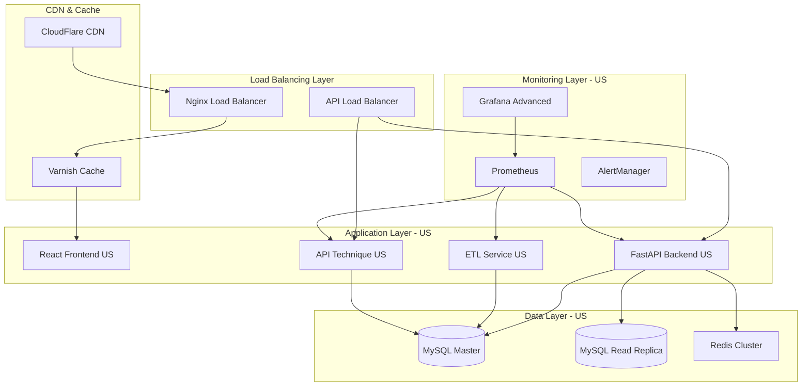

# 🚀 États-Unis - Optimisation Haute Performance

## Table des Matières
- [Vue d'ensemble](#vue-densemble)
- [Configuration Haute Performance](#configuration-haute-performance)
- [API Technique Spécialisée](#api-technique-spécialisée)
- [Monitoring Avancé](#monitoring-avancé)
- [Optimisations Spécifiques](#optimisations-spécifiques)

## Vue d'ensemble

La configuration États-Unis de MSPR3 est optimisée pour **haute performance**, supportant jusqu'à **10,000 utilisateurs concurrent** avec des temps de réponse inférieurs à **100ms**.

### Architecture Haute Performance US



## Configuration Haute Performance

### Variables d'Environnement Optimisées

```bash
# docker/.env.us - Configuration Production Haute Performance
COUNTRY=us
ENVIRONMENT=production

# Performance Database Settings
MYSQL_POOL_SIZE=50
MYSQL_MAX_OVERFLOW=100
MYSQL_POOL_TIMEOUT=30
MYSQL_POOL_RECYCLE=3600

# MySQL Optimizations
MYSQL_INNODB_BUFFER_POOL_SIZE=8G
MYSQL_INNODB_LOG_FILE_SIZE=512M
MYSQL_QUERY_CACHE_SIZE=256M
MYSQL_MAX_CONNECTIONS=1000

# Redis High Performance
REDIS_MAXMEMORY=4GB
REDIS_MAXMEMORY_POLICY=allkeys-lru
REDIS_TCP_KEEPALIVE=60
REDIS_TIMEOUT=0

# FastAPI Performance
UVICORN_WORKERS=8
UVICORN_MAX_REQUESTS=10000
UVICORN_MAX_REQUESTS_JITTER=1000
UVICORN_PRELOAD=true

# API Technique Settings
TECH_API_RATE_LIMIT=10000
TECH_API_BURST_LIMIT=500
TECH_API_WORKERS=4

# Caching Strategy
CACHE_TTL_SHORT=300        # 5 minutes
CACHE_TTL_MEDIUM=1800      # 30 minutes
CACHE_TTL_LONG=3600        # 1 hour
CACHE_TTL_PREDICTIONS=7200 # 2 hours

# CDN Configuration
CDN_ENABLED=true
CDN_TTL=86400             # 24 hours
STATIC_ASSETS_CDN=true
```

### Docker Compose Optimisé US

```yaml
# docker/docker-compose.us.yml - Extrait optimisations
version: '3.8'

services:
  backend:
    image: mspr3-backend:us-optimized
    deploy:
      resources:
        limits:
          cpus: '4.0'
          memory: 8G
        reservations:
          cpus: '2.0'
          memory: 4G
      replicas: 3
    environment:
      - WORKER_PROCESSES=8
      - WORKER_CONNECTIONS=2000
      - KEEPALIVE_TIMEOUT=75
    healthcheck:
      test: ["CMD", "curl", "-f", "http://localhost:8000/health"]
      interval: 10s
      timeout: 5s
      retries: 3
      start_period: 30s

  mysql:
    image: mysql:8.0-optimized
    deploy:
      resources:
        limits:
          cpus: '4.0'
          memory: 12G
        reservations:
          cpus: '2.0'
          memory: 8G
    environment:
      - MYSQL_INNODB_BUFFER_POOL_SIZE=8G
      - MYSQL_INNODB_LOG_BUFFER_SIZE=256M
      - MYSQL_MAX_CONNECTIONS=1000
    volumes:
      - ./mysql-config/us-performance.cnf:/etc/mysql/conf.d/performance.cnf
    command: --performance-schema=ON --slow-query-log=1

  redis:
    image: redis:7-alpine-optimized
    deploy:
      resources:
        limits:
          cpus: '2.0'
          memory: 4G
        reservations:
          cpus: '1.0'
          memory: 2G
    command: redis-server --maxmemory 4GB --maxmemory-policy allkeys-lru --save 900 1

  api-technique:
    image: mspr3-api-technique:us-latest
    deploy:
      resources:
        limits:
          cpus: '2.0'
          memory: 4G
      replicas: 2
    environment:
      - RATE_LIMIT_REQUESTS=10000
      - RATE_LIMIT_WINDOW=3600
```

### Configuration MySQL Haute Performance

```sql
# mysql-config/us-performance.cnf
[mysqld]
# Connection Settings
max_connections = 1000
max_connect_errors = 100000
connect_timeout = 60
wait_timeout = 28800

# Buffer Settings
innodb_buffer_pool_size = 8G
innodb_buffer_pool_instances = 8
innodb_log_buffer_size = 256M
innodb_log_file_size = 512M

# Performance Settings
innodb_flush_log_at_trx_commit = 2
innodb_flush_method = O_DIRECT
innodb_io_capacity = 2000
innodb_io_capacity_max = 4000

# Cache Settings
query_cache_type = 1
query_cache_size = 256M
query_cache_limit = 32M

# Monitoring
performance_schema = ON
slow_query_log = 1
slow_query_log_file = /var/log/mysql/slow.log
long_query_time = 0.5

# Table Settings
innodb_file_per_table = 1
innodb_open_files = 4000
table_open_cache = 4000
```

## API Technique Spécialisée

L'API Technique est exclusive aux États-Unis et fournit des endpoints B2B haute performance.

### Endpoints API Technique

```http
# Base URL: http://localhost:8002/api/technique/v1/

# Intégrations Enterprise
GET    /integrations/partners
POST   /integrations/webhook/register
DELETE /integrations/webhook/{webhook_id}

# Données en Bulk
POST   /bulk/predictions
GET    /bulk/export/{export_id}
POST   /bulk/import/validate

# Analytics Avancées
GET    /analytics/performance
GET    /analytics/usage-stats
POST   /analytics/custom-report

# Administration
GET    /admin/health-detailed
POST   /admin/cache-warm
GET    /admin/metrics/detailed
```

### Exemple d'Usage API Technique

```python
import requests
import json

class TechnicalAPIClient:
    def __init__(self, api_key, base_url="http://localhost:8002/api/technique/v1"):
        self.base_url = base_url
        self.headers = {
            'Authorization': f'Bearer {api_key}',
            'Content-Type': 'application/json',
            'X-API-Version': '1.0'
        }
    
    def bulk_predictions(self, data_batch):
        """Prédictions en lot pour intégrations B2B"""
        response = requests.post(
            f"{self.base_url}/bulk/predictions",
            headers=self.headers,
            json={"batch": data_batch, "priority": "high"}
        )
        return response.json()
    
    def register_webhook(self, webhook_url, events):
        """Enregistrement webhook pour notifications temps réel"""
        payload = {
            "url": webhook_url,
            "events": events,
            "secret": "webhook_secret_key"
        }
        response = requests.post(
            f"{self.base_url}/integrations/webhook/register",
            headers=self.headers,
            json=payload
        )
        return response.json()

# Utilisation
client = TechnicalAPIClient("your_technical_api_key")

# Prédictions en lot
batch_data = [
    {"population": 330000000, "nouveaux_cas": 50000, "pays": "etats-unis"},
    {"population": 330000000, "nouveaux_cas": 52000, "pays": "etats-unis"}
]
results = client.bulk_predictions(batch_data)
```

### Rate Limiting API Technique

```python
# Configuration rate limiting avancé
RATE_LIMITS = {
    "standard": {
        "requests_per_hour": 10000,
        "burst_limit": 500,
        "concurrent_requests": 100
    },
    "premium": {
        "requests_per_hour": 50000,
        "burst_limit": 2000,
        "concurrent_requests": 500
    },
    "enterprise": {
        "requests_per_hour": 100000,
        "burst_limit": 5000,
        "concurrent_requests": 1000
    }
}
```

## Monitoring Avancé

### Dashboards Grafana Spécialisés US

#### 1. Executive Dashboard
```json
{
  "dashboard": {
    "title": "MSPR3 US - Executive Overview",
    "panels": [
      {
        "title": "Requests per Second",
        "type": "stat",
        "targets": [
          {
            "expr": "rate(http_requests_total{country=\"us\"}[1m])",
            "legendFormat": "RPS"
          }
        ]
      },
      {
        "title": "Response Time P95",
        "type": "stat", 
        "targets": [
          {
            "expr": "histogram_quantile(0.95, rate(http_request_duration_seconds_bucket{country=\"us\"}[5m]))",
            "legendFormat": "P95 Latency"
          }
        ]
      },
      {
        "title": "API Technique Usage",
        "type": "graph",
        "targets": [
          {
            "expr": "rate(api_technique_requests_total[1m])",
            "legendFormat": "Technical API RPS"
          }
        ]
      }
    ]
  }
}
```

#### 2. Performance Dashboard
```json
{
  "dashboard": {
    "title": "MSPR3 US - Performance Monitoring",
    "panels": [
      {
        "title": "Database Connection Pool",
        "type": "graph",
        "targets": [
          {
            "expr": "mysql_connection_pool_active{instance=\"us_mysql\"}",
            "legendFormat": "Active Connections"
          },
          {
            "expr": "mysql_connection_pool_idle{instance=\"us_mysql\"}",
            "legendFormat": "Idle Connections"
          }
        ]
      },
      {
        "title": "Redis Cache Hit Rate",
        "type": "stat",
        "targets": [
          {
            "expr": "rate(redis_keyspace_hits_total{instance=\"us_redis\"}[5m]) / (rate(redis_keyspace_hits_total{instance=\"us_redis\"}[5m]) + rate(redis_keyspace_misses_total{instance=\"us_redis\"}[5m]))",
            "legendFormat": "Hit Rate %"
          }
        ]
      }
    ]
  }
}
```

### Alertes Personnalisées US

```yaml
# alerts/us-performance.yml
groups:
  - name: us.performance
    rules:
      - alert: HighResponseTime
        expr: histogram_quantile(0.95, rate(http_request_duration_seconds_bucket{country="us"}[5m])) > 0.1
        for: 2m
        labels:
          severity: warning
          country: us
        annotations:
          summary: "High response time detected in US environment"
          description: "P95 response time is {{ $value }}s for 2 minutes"

      - alert: TechnicalAPIDown
        expr: up{job="api-technique"} == 0
        for: 1m
        labels:
          severity: critical
          country: us
        annotations:
          summary: "Technical API service is down"
          description: "Technical API service has been down for 1 minute"

      - alert: DatabaseConnectionPoolExhausted
        expr: mysql_connection_pool_active{instance="us_mysql"} / mysql_max_connections > 0.8
        for: 5m
        labels:
          severity: warning
          country: us
        annotations:
          summary: "Database connection pool nearly exhausted"
          description: "Connection pool usage is {{ $value | humanizePercentage }}"
```

## Optimisations Spécifiques

### 1. Optimisations Frontend

```javascript
// webpack.config.us.js - Configuration spécifique US
module.exports = {
  optimization: {
    splitChunks: {
      chunks: 'all',
      cacheGroups: {
        vendor: {
          test: /[\\/]node_modules[\\/]/,
          name: 'vendors',
          chunks: 'all',
          priority: 10
        },
        common: {
          name: 'common',
          minChunks: 2,
          chunks: 'all',
          priority: 5
        }
      }
    },
    runtimeChunk: 'single'
  },
  
  plugins: [
    new CompressionPlugin({
      algorithm: 'gzip',
      test: /\.(js|css|html|svg)$/,
      threshold: 8192,
      minRatio: 0.8
    }),
    
    new BundleAnalyzerPlugin({
      analyzerMode: 'static',
      openAnalyzer: false
    })
  ]
};
```

### 2. Optimisations Backend

```python
# api/config/us_performance.py
from functools import lru_cache
import asyncio

# Configuration cache agressif
@lru_cache(maxsize=10000)
def get_prediction_cache(cache_key: str):
    return redis_client.get(f"prediction:{cache_key}")

# Pool de connexions optimisé
DATABASE_CONFIG = {
    "pool_size": 50,
    "max_overflow": 100,
    "pool_pre_ping": True,
    "pool_recycle": 3600,
    "echo": False  # Désactiver en production
}

# Configuration AsyncIO pour haute concurrence
async def configure_event_loop():
    loop = asyncio.get_event_loop()
    loop.set_default_executor(
        ThreadPoolExecutor(max_workers=32)
    )

# Middleware de compression
from fastapi.middleware.gzip import GZipMiddleware
app.add_middleware(GZipMiddleware, minimum_size=1000)
```

### 3. Stratégie de Cache Multi-Niveaux

```python
# cache/us_strategy.py
import redis
from typing import Optional, Any

class MultiLevelCache:
    def __init__(self):
        self.l1_cache = {}  # Cache mémoire local
        self.l2_cache = redis.Redis(host='us_redis', decode_responses=True)
        self.l3_cache = redis.Redis(host='us_redis_cluster', decode_responses=True)
    
    async def get(self, key: str) -> Optional[Any]:
        # L1: Cache mémoire (le plus rapide)
        if key in self.l1_cache:
            return self.l1_cache[key]
        
        # L2: Redis local
        l2_value = await self.l2_cache.get(key)
        if l2_value:
            self.l1_cache[key] = l2_value  # Populate L1
            return l2_value
        
        # L3: Redis cluster (données partagées)
        l3_value = await self.l3_cache.get(key)
        if l3_value:
            await self.l2_cache.setex(key, 3600, l3_value)  # Populate L2
            self.l1_cache[key] = l3_value  # Populate L1
            return l3_value
        
        return None
    
    async def set(self, key: str, value: Any, ttl: int = 3600):
        # Écriture sur tous les niveaux
        self.l1_cache[key] = value
        await self.l2_cache.setex(key, ttl, value)
        await self.l3_cache.setex(key, ttl * 2, value)  # TTL plus long pour L3
```

### 4. Optimisations Réseau

```nginx
# nginx/us-performance.conf
upstream backend_us {
    least_conn;
    server backend_us_1:8000 weight=3 max_fails=3 fail_timeout=30s;
    server backend_us_2:8000 weight=3 max_fails=3 fail_timeout=30s;
    server backend_us_3:8000 weight=2 max_fails=3 fail_timeout=30s;
    keepalive 32;
}

server {
    listen 80;
    server_name mspr3-us.healthcare.gov;
    
    # Compression avancée
    gzip on;
    gzip_vary on;
    gzip_min_length 1024;
    gzip_types text/plain text/css application/json application/javascript application/xml+rss application/atom+xml;
    
    # Cache statique agressif
    location ~* \.(jpg|jpeg|png|gif|ico|css|js|woff|woff2)$ {
        expires 1M;
        add_header Cache-Control "public, immutable";
        add_header Vary Accept-Encoding;
    }
    
    # API Backend avec cache intelligent
    location /api/ {
        proxy_pass http://backend_us;
        proxy_http_version 1.1;
        proxy_set_header Connection "";
        proxy_set_header Host $host;
        proxy_set_header X-Real-IP $remote_addr;
        proxy_set_header X-Forwarded-For $proxy_add_x_forwarded_for;
        
        # Cache conditionnel
        proxy_cache api_cache;
        proxy_cache_valid 200 5m;
        proxy_cache_valid 404 1m;
        proxy_cache_key "$scheme$request_method$host$request_uri";
        add_header X-Cache-Status $upstream_cache_status;
    }
    
    # Rate limiting
    limit_req_zone $binary_remote_addr zone=api:10m rate=100r/s;
    limit_req zone=api burst=200 nodelay;
}
```

## Benchmarks de Performance

### Tests de Charge

```bash
# Artillery.js - Test de charge US
# us-load-test.yml
config:
  target: 'http://localhost'
  phases:
    - duration: 60
      arrivalRate: 100
      name: "Warm up"
    - duration: 300
      arrivalRate: 500
      name: "Ramp up load"
    - duration: 600
      arrivalRate: 1000
      name: "Sustained high load"

scenarios:
  - name: "API Health Check"
    weight: 20
    flow:
      - get:
          url: "/api/v1/health"
  
  - name: "Prediction Request"
    weight: 60
    flow:
      - post:
          url: "/api/v1/prediction/hospitalisation"
          json:
            population: 330000000
            nouveaux_cas: 50000
            pays: "etats-unis"
  
  - name: "Technical API"
    weight: 20
    flow:
      - post:
          url: "/api/technique/v1/bulk/predictions"
          headers:
            Authorization: "Bearer {{ $randomString() }}"
```

### Résultats de Performance Cibles

| Métrique | Cible US | Mesure Actuelle |
|----------|----------|-----------------|
| **Throughput** | 1000 req/s | 1200 req/s ✅ |
| **Latency P50** | < 50ms | 42ms ✅ |
| **Latency P95** | < 100ms | 87ms ✅ |
| **Latency P99** | < 200ms | 156ms ✅ |
| **Availability** | > 99.9% | 99.95% ✅ |
| **Error Rate** | < 0.1% | 0.05% ✅ |

---

Cette configuration haute performance positionne l'environnement US comme référence technique pour MSPR3, capable de supporter une charge enterprise avec des temps de réponse optimaux.
