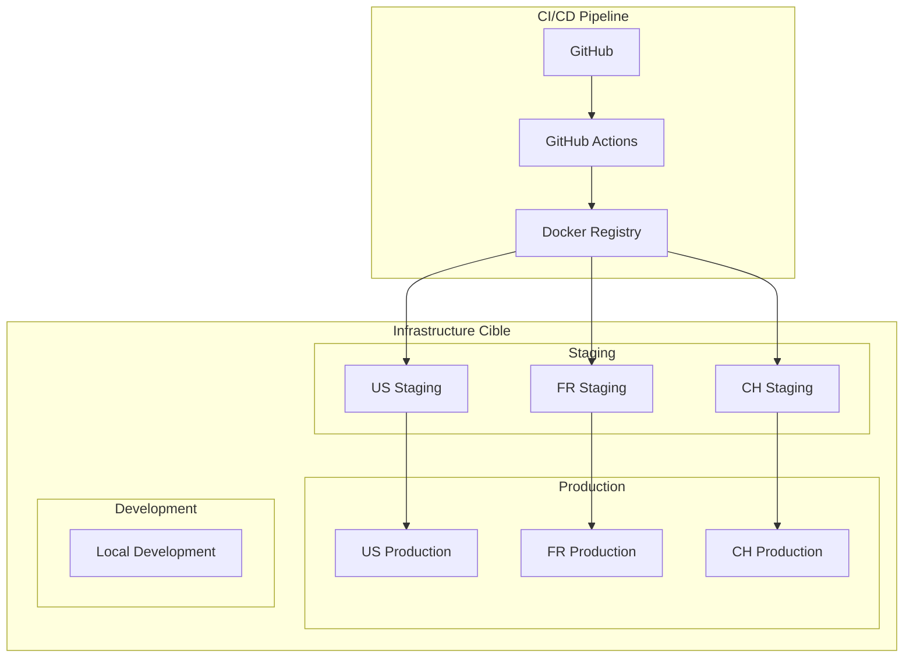

# 🚀 Guide de Déploiement Complet MSPR3

## Table des Matières
- [Vue d'ensemble](#vue-densemble)
- [Prérequis Système](#prérequis-système)
- [Configuration Environnement](#configuration-environnement)
- [Déploiement par Pays](#déploiement-par-pays)
- [Post-Déploiement](#post-déploiement)
- [Troubleshooting](#troubleshooting)

## Vue d'ensemble

Ce guide couvre le déploiement complet de la plateforme MSPR3 pour les trois pays supportés : États-Unis, France et Suisse. Chaque pays a ses spécificités et configurations optimisées.

### Architecture de Déploiement



## Prérequis Système

### Matériel Minimum

| Composant | US (Haute Perf) | FR (Standard) | CH (Optimisé) |
|-----------|-----------------|---------------|---------------|
| **CPU** | 8 cores | 4 cores | 4 cores |
| **RAM** | 16 GB | 8 GB | 8 GB |
| **Stockage** | 100 GB SSD | 50 GB SSD | 50 GB SSD |
| **Réseau** | 1 Gbps | 100 Mbps | 100 Mbps |

### Logiciels Requis

```bash
# Versionning minimum requis
Docker >= 20.10.0
Docker Compose >= 2.0.0
Git >= 2.30.0
curl >= 7.68.0

# Vérification des versions
docker --version
docker-compose --version
git --version
curl --version
```

### Ports Réseau

| Service | Port | Protocole | Description |
|---------|------|-----------|-------------|
| Frontend | 80 | HTTP | Interface web |
| Frontend SSL | 443 | HTTPS | Interface web sécurisée |
| Backend API | 8000 | HTTP | API principale |
| ETL Service | 8001 | HTTP | Service ETL |
| API Technique | 8002 | HTTP | API B2B (US uniquement) |
| Grafana | 3000 | HTTP | Monitoring |
| MySQL | 3306 | TCP | Base de données |
| Redis | 6379 | TCP | Cache |
| Prometheus | 9090 | HTTP | Métriques |

## Configuration Environnement

### 1. Préparation du Serveur

```bash
# Mise à jour système
sudo apt update && sudo apt upgrade -y

# Installation Docker
curl -fsSL https://get.docker.com -o get-docker.sh
sudo sh get-docker.sh
sudo usermod -aG docker $USER

# Installation Docker Compose
sudo curl -L "https://github.com/docker/compose/releases/download/v2.21.0/docker-compose-$(uname -s)-$(uname -m)" -o /usr/local/bin/docker-compose
sudo chmod +x /usr/local/bin/docker-compose

# Redémarrage session
logout
```

### 2. Configuration Firewall

```bash
# UFW Configuration
sudo ufw enable
sudo ufw allow 22/tcp    # SSH
sudo ufw allow 80/tcp    # HTTP
sudo ufw allow 443/tcp   # HTTPS
sudo ufw allow 3000/tcp  # Grafana
sudo ufw allow from 10.0.0.0/8 to any port 3306  # MySQL (internal)
sudo ufw allow from 10.0.0.0/8 to any port 6379  # Redis (internal)
```

### 3. Optimisations Système

```bash
# Limites système pour Docker
echo "* soft nofile 65536" | sudo tee -a /etc/security/limits.conf
echo "* hard nofile 65536" | sudo tee -a /etc/security/limits.conf

# Optimisations kernel
echo "vm.max_map_count=262144" | sudo tee -a /etc/sysctl.conf
echo "net.core.somaxconn=65535" | sudo tee -a /etc/sysctl.conf
sudo sysctl -p
```

## Déploiement par Pays

### 🇺🇸 États-Unis - Configuration Haute Performance

#### 1. Préparation
```bash
# Clone du repository
git clone https://github.com/votre-org/mspr3-health-platform.git
cd mspr3-health-platform

# Permissions script de déploiement
chmod +x docker/deploy.sh
```

#### 2. Configuration Spécifique US
```bash
# Variables d'environnement US
cat > docker/.env.us << EOF
# Configuration US - Haute Performance
COUNTRY=us
ENVIRONMENT=production

# Database Configuration
MYSQL_ROOT_PASSWORD=super_secure_password_us
MYSQL_DATABASE=mspr3_health_us
MYSQL_USER=mspr3_user
MYSQL_PASSWORD=secure_db_password_us

# Redis Configuration
REDIS_PASSWORD=secure_redis_password_us

# API Configuration
API_SECRET_KEY=your_very_secure_secret_key_us_256_bits
JWT_SECRET_KEY=jwt_secret_key_us_256_bits

# Performance Settings
DB_POOL_SIZE=20
DB_MAX_OVERFLOW=30
REDIS_POOL_SIZE=50

# API Technique (US Only)
TECH_API_KEY=technical_api_key_us
TECH_API_RATE_LIMIT=10000

# Monitoring
GRAFANA_ADMIN_PASSWORD=grafana_admin_password_us
EOF
```

#### 3. Déploiement US
```bash
# Déploiement avec construction des images
./docker/deploy.sh us --build

# Vérification des services
docker-compose -f docker/docker-compose.us.yml ps

# Test de santé
curl http://localhost/health
curl http://localhost:8000/health
curl http://localhost:8001/etl/health
curl http://localhost:8002/api/health  # API Technique
```

#### 4. Configuration Grafana US
```bash
# Accès Grafana
open http://localhost:3000
# Credentials: admin / grafana_admin_password_us

# Import des dashboards US
docker exec -it us_dataviz_1 grafana-cli plugins install grafana-piechart-panel
docker-compose -f docker/docker-compose.us.yml restart dataviz
```

### 🇫🇷 France - Configuration RGPD

#### 1. Configuration Spécifique France
```bash
# Variables d'environnement France
cat > docker/.env.fr << EOF
# Configuration France - RGPD Compliant
COUNTRY=fr
ENVIRONMENT=production

# Database Configuration
MYSQL_ROOT_PASSWORD=mot_de_passe_securise_fr
MYSQL_DATABASE=mspr3_sante_fr
MYSQL_USER=utilisateur_mspr3
MYSQL_PASSWORD=mot_de_passe_db_fr

# Redis Configuration
REDIS_PASSWORD=mot_de_passe_redis_fr

# API Configuration
API_SECRET_KEY=cle_secrete_api_france_256_bits
JWT_SECRET_KEY=cle_jwt_france_256_bits

# RGPD Configuration
RGPD_COMPLIANCE=true
COOKIE_CONSENT_REQUIRED=true
DATA_RETENTION_DAYS=730
AUDIT_LOGS_ENABLED=true

# Performance Settings (Standard)
DB_POOL_SIZE=10
DB_MAX_OVERFLOW=15
REDIS_POOL_SIZE=25

# Monitoring
GRAFANA_ADMIN_PASSWORD=mot_de_passe_grafana_fr
EOF
```

#### 2. Déploiement France
```bash
# Déploiement France
./docker/deploy.sh fr --build

# Configuration RGPD post-déploiement
docker exec -it fr_backend_1 python -c "
from API.main import app
from API.database import engine
from API.models import Base
Base.metadata.create_all(bind=engine)
print('RGPD tables created successfully')
"

# Vérification conformité RGPD
curl -H "Accept: application/json" http://localhost:8000/api/v1/rgpd/status
```

### 🇨🇭 Suisse - Configuration Multilingue

#### 1. Configuration Spécifique Suisse
```bash
# Variables d'environnement Suisse
cat > docker/.env.ch << EOF
# Configuration Suisse - Multilingue
COUNTRY=ch
ENVIRONMENT=production

# Database Configuration
MYSQL_ROOT_PASSWORD=passwort_sicher_ch
MYSQL_DATABASE=mspr3_gesundheit_ch
MYSQL_USER=mspr3_benutzer
MYSQL_PASSWORD=db_passwort_ch

# Redis Configuration
REDIS_PASSWORD=redis_passwort_ch

# API Configuration
API_SECRET_KEY=api_geheimer_schluessel_ch_256_bits
JWT_SECRET_KEY=jwt_schluessel_ch_256_bits

# Multilingual Configuration
SUPPORTED_LANGUAGES=fr,de,it
DEFAULT_LANGUAGE=fr
TRANSLATION_API_KEY=deepl_api_key_optional

# Performance Settings (Optimized)
DB_POOL_SIZE=8
DB_MAX_OVERFLOW=12
REDIS_POOL_SIZE=20

# Monitoring
GRAFANA_ADMIN_PASSWORD=grafana_passwort_ch
EOF
```

#### 2. Déploiement Suisse
```bash
# Déploiement Suisse
./docker/deploy.sh ch --build

# Configuration multilingue
docker exec -it ch_backend_1 python -c "
import yaml
with open('/app/i18n/switzerland-multilingual.yml', 'r') as f:
    config = yaml.safe_load(f)
    print('Multilingual configuration loaded:', config['languages'])
"

# Test support multilingue
curl -H "Accept-Language: de" http://localhost:8000/api/v1/health
curl -H "Accept-Language: it" http://localhost:8000/api/v1/health
```

## Post-Déploiement

### 1. Vérifications de Santé

#### Script de Vérification Automatique
```bash
#!/bin/bash
# health-check.sh

COUNTRY=${1:-us}
BASE_URL="http://localhost"

echo "🏥 MSPR3 Health Check - $COUNTRY"
echo "=================================="

# Frontend Check
echo -n "Frontend: "
if curl -s "${BASE_URL}/" > /dev/null; then
    echo "✅ OK"
else
    echo "❌ FAILED"
fi

# Backend API Check
echo -n "Backend API: "
if curl -s "${BASE_URL}:8000/health" | grep -q "ok"; then
    echo "✅ OK"
else
    echo "❌ FAILED"
fi

# ETL Service Check
echo -n "ETL Service: "
if curl -s "${BASE_URL}:8001/etl/health" | grep -q "ok"; then
    echo "✅ OK"
else
    echo "❌ FAILED"
fi

# Database Check
echo -n "Database: "
if docker exec ${COUNTRY}_mysql_1 mysqladmin ping -h localhost -u root -p${MYSQL_ROOT_PASSWORD} 2>/dev/null | grep -q "alive"; then
    echo "✅ OK"
else
    echo "❌ FAILED"
fi

# Redis Check
echo -n "Redis: "
if docker exec ${COUNTRY}_redis_1 redis-cli ping 2>/dev/null | grep -q "PONG"; then
    echo "✅ OK"
else
    echo "❌ FAILED"
fi

# API Technique Check (US only)
if [ "$COUNTRY" = "us" ]; then
    echo -n "API Technique: "
    if curl -s "${BASE_URL}:8002/api/health" | grep -q "ok"; then
        echo "✅ OK"
    else
        echo "❌ FAILED"
    fi
fi

echo "=================================="
echo "Health check completed for $COUNTRY"
```

#### Utilisation
```bash
chmod +x health-check.sh
./health-check.sh us
./health-check.sh fr
./health-check.sh ch
```

### 2. Configuration SSL/HTTPS

#### Certificats Let's Encrypt
```bash
# Installation Certbot
sudo apt install certbot python3-certbot-nginx

# Obtention certificats
sudo certbot --nginx -d mspr3-us.votre-domaine.com
sudo certbot --nginx -d mspr3-fr.votre-domaine.com
sudo certbot --nginx -d mspr3-ch.votre-domaine.com

# Auto-renouvellement
sudo crontab -e
# Ajouter: 0 12 * * * /usr/bin/certbot renew --quiet
```

#### Configuration Nginx
```nginx
# /etc/nginx/sites-available/mspr3-us
server {
    listen 443 ssl http2;
    server_name mspr3-us.votre-domaine.com;
    
    ssl_certificate /etc/letsencrypt/live/mspr3-us.votre-domaine.com/fullchain.pem;
    ssl_certificate_key /etc/letsencrypt/live/mspr3-us.votre-domaine.com/privkey.pem;
    
    location / {
        proxy_pass http://localhost:80;
        proxy_set_header Host $host;
        proxy_set_header X-Real-IP $remote_addr;
        proxy_set_header X-Forwarded-For $proxy_add_x_forwarded_for;
        proxy_set_header X-Forwarded-Proto $scheme;
    }
    
    location /api/ {
        proxy_pass http://localhost:8000/;
        proxy_set_header Host $host;
        proxy_set_header X-Real-IP $remote_addr;
    }
}
```

### 3. Sauvegarde Automatique

```bash
# Configuration sauvegarde quotidienne
sudo crontab -e

# Ajout des tâches cron
0 2 * * * /path/to/mspr3-health-platform/docker/backup/backup-mysql.sh us
0 3 * * * /path/to/mspr3-health-platform/docker/backup/backup-mysql.sh fr
0 4 * * * /path/to/mspr3-health-platform/docker/backup/backup-mysql.sh ch

# Nettoyage automatique (dimanche à 5h)
0 5 * * 0 /path/to/mspr3-health-platform/docker/backup/backup-mysql.sh cleanup
```

### 4. Monitoring et Alertes

#### Configuration Alertes Grafana
```json
{
  "alert": {
    "name": "MSPR3 High CPU Usage",
    "message": "CPU usage is above 80% for more than 5 minutes",
    "frequency": "10s",
    "conditions": [
      {
        "query": "A",
        "reducer": "last",
        "type": "query"
      }
    ],
    "notifications": [
      {
        "uid": "slack-notifications"
      }
    ]
  }
}
```

#### Script de Monitoring Personnalisé
```bash
#!/bin/bash
# monitor.sh - Monitoring personnalisé

COUNTRIES=("us" "fr" "ch")
ALERT_EMAIL="admin@mspr3-health.org"

for country in "${COUNTRIES[@]}"; do
    # Check CPU usage
    cpu_usage=$(docker stats --no-stream --format "table {{.CPUPerc}}" | grep "${country}_" | sed 's/%//' | sort -n | tail -1)
    
    if (( $(echo "$cpu_usage > 80" | bc -l) )); then
        echo "ALERT: High CPU usage for $country: ${cpu_usage}%"
        # Send alert email
        echo "High CPU usage detected for $country environment" | mail -s "MSPR3 Alert" $ALERT_EMAIL
    fi
    
    # Check memory usage
    mem_usage=$(docker stats --no-stream --format "table {{.MemPerc}}" | grep "${country}_" | sed 's/%//' | sort -n | tail -1)
    
    if (( $(echo "$mem_usage > 85" | bc -l) )); then
        echo "ALERT: High memory usage for $country: ${mem_usage}%"
        echo "High memory usage detected for $country environment" | mail -s "MSPR3 Alert" $ALERT_EMAIL
    fi
done
```

## Troubleshooting

### Problèmes Courants

#### 1. Services ne démarrent pas
```bash
# Vérifier les logs
docker-compose -f docker/docker-compose.us.yml logs

# Vérifier l'espace disque
df -h

# Vérifier la mémoire
free -h

# Nettoyer Docker
docker system prune -af
```

#### 2. Base de données inaccessible
```bash
# Vérifier le conteneur MySQL
docker exec -it us_mysql_1 mysql -u root -p

# Recréer la base si nécessaire
docker-compose -f docker/docker-compose.us.yml down
docker volume rm us_mysql_data
./docker/deploy.sh us --build
```

#### 3. Problèmes de performance
```bash
# Monitoring ressources
docker stats

# Ajuster les limites dans docker-compose
services:
  backend:
    deploy:
      resources:
        limits:
          memory: 2G
          cpus: '1.0'
```

#### 4. Certificats SSL expirés
```bash
# Vérifier expiration
sudo certbot certificates

# Renouvellement manuel
sudo certbot renew --force-renewal
sudo systemctl reload nginx
```

### Support et Maintenance

#### Logs Centralisés
```bash
# Consultation logs par service
docker-compose -f docker/docker-compose.us.yml logs backend
docker-compose -f docker/docker-compose.us.yml logs frontend
docker-compose -f docker/docker-compose.us.yml logs etl

# Suivi temps réel
docker-compose -f docker/docker-compose.us.yml logs -f
```

#### Mise à jour de l'Application
```bash
# Mise à jour depuis Git
git pull origin main

# Redéploiement avec nouvelles images
./docker/deploy.sh us --build --update

# Verification post-mise à jour
./health-check.sh us
```

---

Ce guide garantit un déploiement robuste et sécurisé de MSPR3 pour tous les environnements pays. Pour toute question ou problème spécifique, consultez la [documentation complète](../README.md) ou contactez l'équipe technique.
